# Módulo: :app

**Ruta:** `/app`  
**Dependencias directas:** `:common`, `:token`, `:lexer`, `:ast`, `:parser`, `:semantic`, `:interpreter`, `:cli`  
**Consumidores:** Punto de entrada final (CLI y ejecutables de aplicación)  

---

## 1. Responsabilidad y Propósito (SRP)
- **Qué problema resuelve:** Actúa como el orquestador raíz e integrador de todos los subsistemas del compilador. Ensambla el pipeline completo de PrintScript 1.0 (`Lexer` $\rightarrow$ `Parser` $\rightarrow$ `Semantic` $\rightarrow$ `Interpreter`), define la configuración modular del lenguaje y expone el punto de entrada de la aplicación (`main`).
- **Qué hace:**
  - Define `Config`: contenedor de las instancias configuradas de cada etapa del compilador.
  - Implementa `Compiler`: ejecuta el pipeline de compilación de punta a punta con semántica fail-fast.
  - Aloja la configuración modular de PrintScript en el paquete `cnc.config`:
    - `Tokens.kt`: Definición de palabras clave (`CncKeywords`), operadores (`CncSymbols`) y patrones (`CncPatterns`).
    - `LexerConfig.kt`: Reglas léxicas e instancia de `printScriptLexer`.
    - `ParserConfig.kt`: Reglas de expresiones Pratt y parser predictivo `printScriptParser`.
    - `SemanticConfig.kt`: Reglas de compatibilidad de tipos, tabla de símbolos y `semanticContext`.
    - `InterpreterConfig.kt`: Configuración del intérprete mediante presets (`printScriptInterpreter`).
    - `CLI.kt`: Comandos del sistema (`GccCommand`, `CLISystem`).
- **Qué NO hace (Fronteras):**
  - No implementa algoritmos de parsing, lexing ni interpretación desde cero; únicamente compone y conecta las piezas provistas por los módulos especializados.

---

## 2. Arquitectura y Componentes Clave

### Diagrama del Pipeline Completo

```mermaid
flowchart LR
    Source["ContentManager (Archivo / String)"] -->|openStream| Stream["CharCursor"]
    Stream --> Lexer["Lexer (printScriptLexer)"]
    Lexer -->|Sequence Token| Parser["Parser (printScriptParser)"]
    Parser -->|Sequence Statement| Semantic["SemanticAnalyzer (semanticContext)"]
    Semantic -->|Sequence Statement validada| Interpreter["Interpreter (printScriptInterpreter)"]
    Interpreter --> Output["Efectos de Ejecución / Consola"]
```


### Entidades de Dominio e Interfaces
1. **`Config`:**
   - Inmutable:
     ```kotlin
     data class Config(
         val lexer: Lexer = printScriptLexer,
         val parser: Parser = printScriptParser,
         val semantic: SemanticAnalyzer = SemanticAnalyzer(semanticContext),
         val interpreter: Interpreter = printScriptInterpreter
     )
     ```
2. **`Compiler`:**
   - Orquestador del flujo:
     ```kotlin
     data class Compiler(val config: Config) {
         fun compile(content: ContentManager)
         fun compile(path: String)
     }
     ```
   - Si alguna etapa emite `Failure`, interrumpe el pipeline inmediatamente informando el error y evitando el paso a la etapa posterior.
3. **Módulos de Configuración (`cnc.config.*`):**
   - Estructura desacoplada en archivos especializados que evitan la sobrecarga de un único archivo monolítico.

---

## 3. Manejo de Errores y Pipeline Funcional
- **ErrorType asociados:** Puede recibir y reportar cualquier `ErrorType` (`LEXER`, `PARSER`, `SEMANTIC`, `RUNTIME`, `CLI`).
- **Garantías:** Pipeline de tolerancia a fallos limpio y determinista. Ningún error en ningún nivel arroja un stacktrace no controlado en la consola de usuario; todos se formatean como diagnósticos claros (`ERROR: <mensaje>`).

---

## 4. Ejemplo Práctico Autónomo (End-to-End)

```kotlin
package example

import cnc.Compiler
import cnc.Config
import cnc.common.StringContent

fun main() {
    // 1. Instanciar compilador con configuración por defecto
    val compiler = Compiler(Config())

    // 2. Compilar y ejecutar un programa PrintScript 1.0 válido
    val codigoFuente = """
        let saludo: string = "Hola desde CNC PrintScript!";
        let a: number = 10;
        let b: number = 5 * 2;
        let total: number = a + b;
        println(saludo);
        println("Total calculado:", total);
    """.trimIndent()

    println("=== Ejecutando Compilación ===")
    compiler.compile(StringContent(codigoFuente))
    // Salida esperada en consola:
    // Hola desde CNC PrintScript!
    // Total calculado: 20

    // 3. Demostración de detención ante error de tipos en pipeline
    val codigoConError = """
        let x: number = "no soy un numero";
        println("Esto nunca debería ejecutarse", x);
    """.trimIndent()

    println("\n=== Ejecutando Código con Error ===")
    compiler.compile(StringContent(codigoConError))
    // Salida esperada en consola:
    // ERROR: Se esperaba 'number' pero se obtuvo 'string'
}
```

---

## 5. Integración en el Pipeline del Compilador
- **Entrada:** Rutas de archivos vía CLI o instancias de `ContentManager`.
- **Salida:** Ejecución completa del programa de usuario mediante el motor compuesto de PrintScript.

---

## 6. Decisiones Técnicas y Tradeoffs
- **Arquitectura de Configuración por Presets:** En lugar de atar el compilador a una única versión estática, `Config` recibe instancias configurables. Esto permite fácilmente crear presets para versiones futuras (ej: `printScript11Config`) intercambiando únicamente las reglas del lexer, parser y semántico sin duplicar la lógica de ejecución del `Compiler`.
