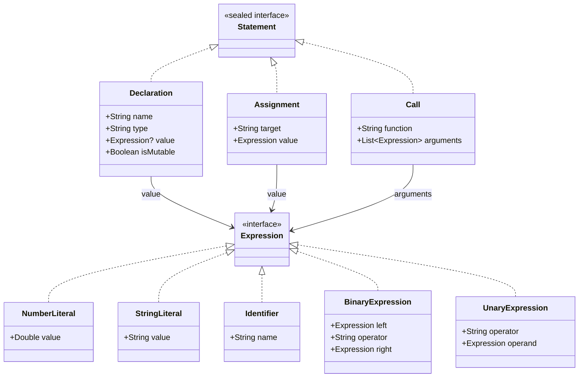

# Módulo: :ast

**Ruta:** `/ast`  
**Dependencias directas:** Ninguna  
**Consumidores:** `:parser`, `:semantic`, `:interpreter`, `:app`  

---

## 1. Responsabilidad y Propósito (SRP)
- **Qué problema resuelve:** Define la representación intermedia pura e inmutable del programa en forma de Árbol de Sintaxis Abstracta (AST). Es el modelo de datos canónico que desacopla la fase de análisis sintáctico de las fases de análisis semántico y de interpretación.
- **Qué hace:**
  - Define la jerarquía de sentencias tipadas (`Statement`).
  - Define la jerarquía de expresiones puras (`Expression`).
  - Modela declaraciones con mutabilidad (`Declaration`), asignaciones (`Assignment`) y llamadas a funciones (`Call`).
  - Modela literales, identificadores, expresiones binarias y unarias.
- **Qué NO hace (Fronteras):**
  - No contiene lógica de negocio, reglas de tipos ni algoritmos de evaluación.
  - No utiliza el patrón Visitor pesado ni mutaciones internas; es una jerarquía de datos inmutable.

---

## 2. Arquitectura y Componentes Clave

### Diagrama de Jerarquía del AST


### Entidades de Dominio e Interfaces
1. **`Statement` (Sentencias):**
   - Interfaz sellada (`sealed interface Statement`).
   - `Declaration`: Representa `let x: number = expr;` o constantes inmutables (`isMutable = false`). El valor inicial `value` es opcional (variables no inicializadas).
   - `Assignment`: Representa `x = expr;`.
   - `Call`: Representa `println(expr1, expr2);`.
2. **`Expression` (Expresiones):**
   - Interfaz base pura: `interface Expression`.
   - `NumberLiteral(val value: Double)`: Literales numéricos.
   - `StringLiteral(val value: String)`: Literales de texto.
   - `Identifier(val name: String)`: Referencias a variables por nombre.
   - `BinaryExpression(left, operator, right)`: Operaciones binarias compuestas recursivas (`+`, `-`, `*`, `/`, etc.).
   - `UnaryExpression(operator, operand)`: Operaciones unarias prefijas (ej: `-x`).

---

## 3. Manejo de Errores y Pipeline Funcional
- **Garantías:** Máxima inmutabilidad. Todos los nodos son `data class` finales sin estado mutable. La exhaustividad en los consumidores (`when (statement)`) es garantizada por el compilador de Kotlin gracias a `sealed interface`.

---

## 4. Ejemplo Práctico Autónomo (End-to-End)

```kotlin
package example

import cnc.ast.*

fun main() {
    // 1. Construcción manual de un árbol de expresión: -(10 + 5)
    val expr: Expression = UnaryExpression(
        operator = "-",
        operand = BinaryExpression(
            left = NumberLiteral(10.0),
            operator = "+",
            right = NumberLiteral(5.0)
        )
    )

    // 2. Sentencia de declaración: let total: number = -(10 + 5);
    val decl: Statement = Declaration(
        name = "total",
        type = "number",
        value = expr,
        isMutable = true
    )

    // 3. Sentencia de llamada: println("El total es:", total);
    val call: Statement = Call(
        function = "println",
        arguments = listOf(
            StringLiteral("El total es:"),
            Identifier("total")
        )
    )

    println("Declaración: $decl")
    println("Llamada: $call")
}
```

---

## 5. Integración en el Pipeline del Compilador
- **Entrada:** Construido por el `:parser` a partir de los tokens.
- **Salida:** Alimentado al `:semantic` para validación estática de tipos, y posteriormente al `:interpreter` para ejecución.

---

## 6. Decisiones Técnicas y Tradeoffs
- **Patrón Algebraico vs Visitor Clásico:** En lugar de acoplar cada nodo del AST con métodos `accept(visitor)`, los nodos son tipos de datos puros. Las operaciones (verificación semántica, evaluación, impresión) se implementan externamente mediante pattern matching exhaustivo (`when (node)`), facilitando agregar nuevas operaciones sin tocar el AST.
