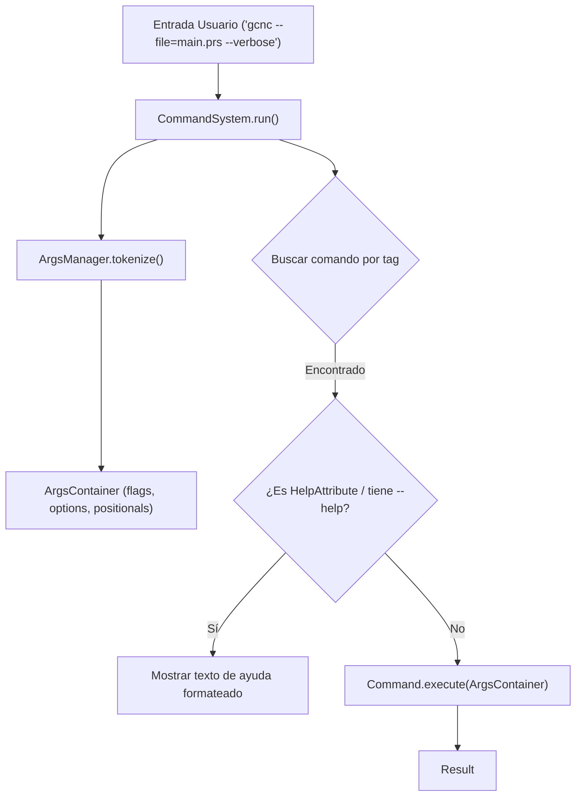

# Módulo: :cli

**Ruta:** `/cli`  
**Dependencias directas:** `:common`  
**Consumidores:** `:app`  

---

## 1. Responsabilidad y Propósito (SRP)
- **Qué problema resuelve:** Provee la infraestructura de línea de comandos interactiva y no interactiva, el parseo de argumentos, flags (`--flag`), opciones clave-valor (`--key=value`) y argumentos posicionales, así como el sistema de ayuda y decoradores de comandos.
- **Qué hace:**
  - Despacha comandos de consola mediante `CommandSystem`.
  - Provee la interfaz `Command` con firma de ejecución desacoplada `fun execute(params: ArgsContainer): Result<Unit>`.
  - Parsea cadenas de argumentos a través de `ArgsManager` y las encapsula en `ArgsContainer`.
  - Implementa el decorador `HelpAttribute` para generar ayuda estructurada y banderas `--help`.
  - Abstrae la entrada/salida de consola mediante `IOManager` (`StdIO`).
- **Qué NO hace (Fronteras):**
  - No contiene lógica del compilador ni de parsing de lenguaje. Solo orquesta los comandos de usuario.

---

## 2. Arquitectura y Componentes Clave

### Diagrama de Arquitectura


### Entidades de Dominio e Interfaces
1. **`Command`:**
   - Interfaz base: `val tag: String; fun execute(params: ArgsContainer): Result<Unit>`.
2. **`ArgsContainer`:**
   - Contenedor inmutable de argumentos parseados:
     - `hasFlag(name: String): Boolean`: Verifica presencia de banderas (ej: `--verbose`).
     - `getOption(name: String): String?`: Obtiene valores asociados (ej: `--file=path`).
     - `getPositional(index: Int): String?`: Obtiene argumentos posicionales.
3. **`HelpAttribute`:**
   - Patrón Decorator sobre `Command`: envuelve un comando agregando `description`, `usage` y `paramHelp` detallado. Intercepta automáticamente invocaciones con `--help` o `-h`.
4. **`CommandSystem`:**
   - Motor del bucle REPL o ejecución por líneas: maneja comandos integrados (`help`, `exit`, `quit`) y delega a los comandos registrados.

---

## 3. Manejo de Errores y Pipeline Funcional
- **ErrorType asociado:** `ErrorType.CLI`.
- **Garantías:** Comandos con argumentos faltantes, opciones desconocidas o errores de I/O retornan `Failure("...", ErrorType.CLI)` sin arrojar excepciones a la consola.

---

## 4. Ejemplo Práctico Autónomo (End-to-End)

```kotlin
package example

import cnc.cli.*
import cnc.cli.args.ArgsContainer
import cnc.cli.command.Command
import cnc.cli.command.HelpAttribute
import cnc.common.ErrorType
import cnc.common.Failure
import cnc.common.Result
import cnc.common.Success

// 1. Definir un comando personalizado
class SaludoCommand : Command {
    override val tag = "saludar"

    override fun execute(params: ArgsContainer): Result<Unit> {
        val nombre = params.getOption("nombre") ?: params.getPositional(0)
            ?: return Failure("Falta el parámetro 'nombre'. Uso: saludar --nombre=<nombre>", ErrorType.CLI)

        val esFormal = params.hasFlag("formal")
        val mensaje = if (esFormal) "Estimado/a $nombre, un cordial saludo." else "¡Hola $nombre!"
        println(mensaje)
        return Success("ok", Unit)
    }
}

fun main() {
    // 2. Decorar el comando con ayuda
    val comandoDecorado = HelpAttribute(
        wrapped = SaludoCommand(),
        description = "Emite un saludo en consola",
        usage = "saludar [--nombre=<texto>] [--formal]",
        paramHelp = mapOf(
            "--nombre=<texto>" to "Nombre de la persona a saludar",
            "--formal" to "Aplica formato protocolar"
        )
    )

    // 3. Instanciar el sistema de comandos
    val cli = CommandSystem(
        cmds = mapOf(comandoDecorado.tag to comandoDecorado)
    )

    // Simular ejecución
    cli.run("saludar --nombre=Bautista --formal")
    cli.run("help saludar")
}
```

---

## 5. Integración en el Pipeline del Compilador
- **Entrada:** Líneas de comandos ingresadas por el usuario o invocación desde terminal.
- **Salida:** Dispara la compilación delegando a `Compiler.compile()` en el módulo `:app`.

---

## 6. Decisiones Técnicas y Tradeoffs
- **Patrón Decorator para Documentación:** La ayuda no contamina la lógica interna de `Command.execute()`. `HelpAttribute` envuelve limpiamente el comando y añade las capacidades de introspección y formateo sin acoplamiento.
