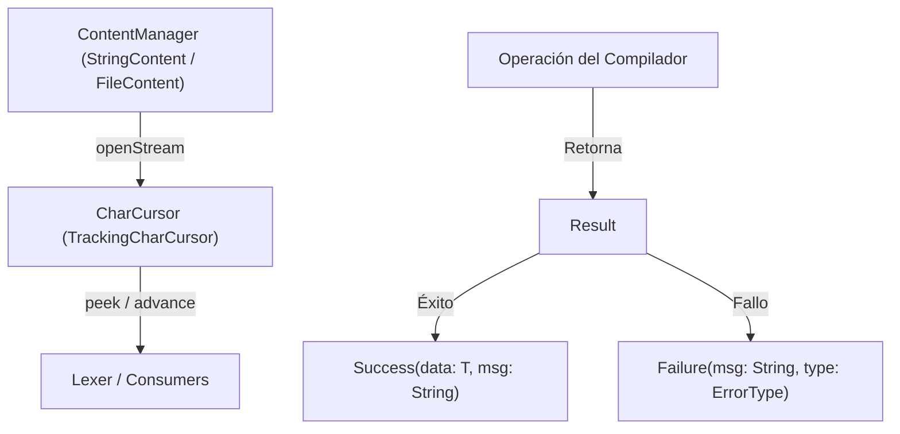

# Módulo: :common

**Ruta:** `/common`  
**Dependencias directas:** Ninguna (módulo base del sistema)  
**Consumidores:** `:token`, `:lexer`, `:parser`, `:semantic`, `:interpreter`, `:cli`, `:app`  

---

## 1. Responsabilidad y Propósito (SRP)
- **Qué problema resuelve:** Provee los tipos de infraestructura transversal, el manejo funcional de resultados y errores sin excepciones en runtime, el streaming de caracteres con cálculo de coordenadas 2D en memoria constante, y la abstracción de fuentes de entrada de código fuente.
- **Qué hace:**
  - Modela el patrón `Result<T>` (`Success<T>` y `Failure<T>`) con discriminación funcional vía `ErrorType`.
  - Provee primitivas funcionales (`map`, `flatMap`, `onSuccess`, `onFailure`).
  - Implementa cursores perezosos (`Cursor<T>` y `CharCursor`) con lookahead arbitrario $O(1)$ amortizado (`peek(offset)`).
  - Gestiona orígenes de contenido (`ContentManager`, `FileContent`, `StringContent`) y apertura de streams (`openStream()`).
- **Qué NO hace (Fronteras):**
  - No define tipos de tokens específicos ni gramática alguna.
  - No realiza análisis sintáctico ni validaciones léxicas.
  - No depende de ningún otro módulo del proyecto.

---

## 2. Arquitectura y Componentes Clave

### Diagrama de Componentes


### Entidades de Dominio e Interfaces
1. **`Result<T>`:**
   - Interfaz sellada con `val msg: String` y `fun isOk(): Boolean`.
   - `Success<T>(val msg: String, val data: T)`: Representa la computación exitosa con su payload tipado.
   - `Failure<T>(val msg: String, val type: ErrorType)`: Representa un fallo tipado según el subsistema emisor.
2. **`ErrorType`:**
   - Enum exhaustivo: `LEXER`, `PARSER`, `SEMANTIC`, `CLI`, `INTERPRETER`, `RUNTIME`.
3. **`Cursor<T>`:**
   - Interfaz genérica para consumo secuencial: `val currentOffset: Int`, `hasMore()`, `peek(offset: Int = 0): T?`, `advance(): T?`.
   - `SequenceCursor<T>`: Implementación respaldada por `ArrayDeque` para lookahead sin adelantar el iterador subyacente.
4. **`CharCursor`:**
   - Especialización para caracteres que expone `val currentPosition: Position` (`line`, `column`) con seguimiento mediante contadores primitivos `Int` en la JVM (cero alocaciones en el heap por avance de caracter).
5. **`ContentManager`:**
   - Interfaz para abstracción de fuentes de datos. Implementada por `StringContent(text)` y `FileContent(path)`.

---

## 3. Manejo de Errores y Pipeline Funcional
- **ErrorType asociados:** Declara todo el espectro de errores del compilador (`ErrorType`).
- **Garantías:** Cero excepciones no controladas. Toda operación susceptible a fallar en cualquier módulo debe retornar `Result<T>` o una secuencia perezosa de `Result<T>`, permitiendo a los pipelines detenerse de forma limpia (*fail-fast*) o recolectar diagnósticos.

---

## 4. Ejemplo Práctico Autónomo (End-to-End)

```kotlin
package example

import cnc.common.*

fun main() {
    // 1. Uso de ContentManager y CharCursor
    val source = StringContent("let x = 42;\nlet y = 10;")
    val cursor: CharCursor = source.openStream()

    println("Primer caracter (peek 0): '${cursor.peek(0)}'") // 'l'
    println("Cuarto caracter (peek 3): '${cursor.peek(3)}'") // ' '
    println("Posición inicial: line=${cursor.currentPosition.line}, col=${cursor.currentPosition.column}")

    // Consumir "let"
    val palabra = cursor.consume(3)
    println("Consumido: '$palabra'") // "let"
    println("Nueva posición: line=${cursor.currentPosition.line}, col=${cursor.currentPosition.column}")

    // 2. Uso del Result Pattern con transformaciones funcionales
    val divisionExitosa = dividir(10.0, 2.0)
    divisionExitosa
        .map { it * 100 }
        .onSuccess { println("Resultado éxito: ${it.data}") } // 500.0

    val divisionFallida = dividir(10.0, 0.0)
    divisionFallida
        .onFailure { println("Error capturado: [${it.type}] ${it.msg}") } 
        // Error capturado: [RUNTIME] No se puede dividir por cero
}

fun dividir(a: Double, b: Double): Result<Double> {
    if (b == 0.0) {
        return Failure("No se puede dividir por cero", ErrorType.RUNTIME)
    }
    return Success("ok", a / b)
}
```

---

## 5. Integración en el Pipeline del Compilador
- **Entrada:** Código fuente crudo provisto como archivo en disco (`FileContent`) o memoria (`StringContent`).
- **Salida:** Flujo de caracteres tipado (`CharCursor`) con coordenadas 2D listo para que el `:lexer` consuma caracteres y emita tokens; y la infraestructura `Result<T>` sobre la que operan todos los módulos subsiguientes.

---

## 6. Decisiones Técnicas y Tradeoffs
- **Cero Alocaciones por Carácter:** En lugar de crear un nuevo objeto `Position` en cada avance de caracter, `TrackingCharCursor` actualiza enteros primitivos internos (`_line`, `_col`). La instancia `Position` solo se aloca cuando un token realmente es emitido.
- **Lookahead Amortizado $O(1)$:** El uso de `ArrayDeque` en `SequenceCursor` permite inspeccionar arbitrariamente hacia adelante sin perder la naturaleza perezosa de los streams de Kotlin.
