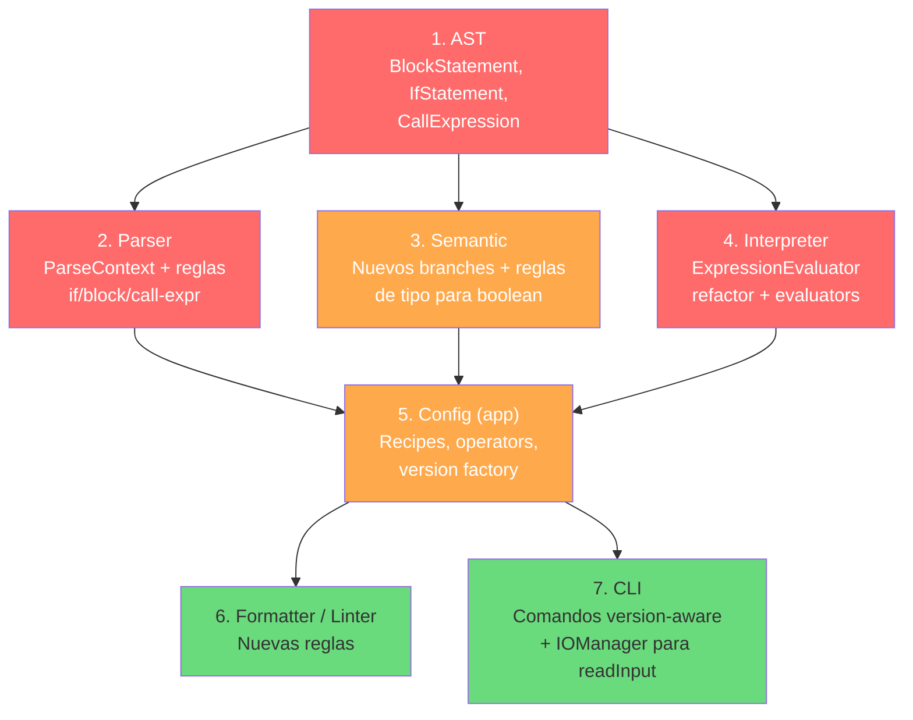

# Análisis Arquitectónico: Impedimentos para PrintScript 1.1

> [!NOTE]
> Este documento analiza exhaustivamente la arquitectura actual del motor **CNC** e identifica cada punto de fricción que impide la implementación limpia de PrintScript 1.1. Para cada impedimento se presentan soluciones posibles y una recomendación final alineada con la filosofía de diseño del proyecto.

---

## Requerimientos de PrintScript 1.1

Según la [especificación](file:///C:/Users/Usuario/Documents/projects/CNC/docs/specification.md) y el [roadmap](file:///C:/Users/Usuario/Documents/projects/CNC/docs/roadmap.md):

| Feature | Ejemplo | Impacto en Módulos |
|---|---|---|
| Inmutabilidad (`const`) | `const PI: number = 3.14;` | AST, Parser, Semantic, Interpreter |
| Tipo booleano | `let flag: boolean = true;` | Token, Lexer, AST, Parser, Semantic, Interpreter |
| Condicionales (`if`/`else`) | `if (x) { ... } else { ... }` | **Todos los módulos** |
| Entrada de usuario | `let name: string = readInput("Nombre:");` | AST, Parser, Interpreter, CLI |
| Variables de entorno | `let env: string = readEnv("PATH");` | AST, Parser, Interpreter |
| Formatter para v1.1 | Indentación de bloques, nuevos nodos | Formatter |
| Linter para v1.1 | Reglas sobre `const`, booleanos | Linter |

---

## Impedimentos Identificados

### 1. 🔴 `Call` existe solo como `Statement`, no como `Expression`

**Severidad**: Bloqueante  
**Módulos afectados**: `:ast`, `:parser`, `:interpreter`, `:semantic`

**Problema**: En PrintScript 1.1, `readInput()` y `readEnv()` retornan valores y deben poder usarse dentro de expresiones:

```typescript
let name: string = readInput("Nombre:");     // readInput es una expresión aquí
let path: string = readEnv("PATH");
println(readInput("dato:"));                   // anidado como argumento
```

Actualmente, [`Call`](file:///C:/Users/Usuario/Documents/projects/CNC/ast/src/main/kotlin/ast/Statement.kt#L17-L20) solo implementa `Statement`:

```kotlin
data class Call(
    val function: String,
    val arguments: List<Expression>
) : Statement   // ❌ No es Expression
```

El [`ExpressionBuilder`](file:///C:/Users/Usuario/Documents/projects/CNC/parser/src/main/kotlin/cnc/parser/expression/ExpressionBuilder.kt) (parser Pratt) solo sabe parsear **átomos** (literales, identificadores), **operadores binarios/unarios** y **agrupación con paréntesis**. No tiene mecanismo para reconocer un identificador seguido de `(` como una llamada a función que retorna un valor.

**Soluciones posibles**:

| Opción | Descripción | Pros | Contras |
|---|---|---|---|
| **A) Nuevo nodo `CallExpression : Expression`** | Crear un nodo AST separado para llamadas que retornan valor | Separación clara de semántica (call-como-efecto vs call-como-valor) | Dos nodos similares; necesita `ExpressionStatement` wrapper |
| **B) `Call` implementa ambos (`Statement` y `Expression`)** | `Call` hereda de ambas interfaces | Un solo nodo, simple | Viola SRP; el intérprete necesita distinguir contextos; `Statement` es `sealed` |
| **C) `Call` → solo `Expression` + `ExpressionStatement` wrapper** | `Call` pasa a ser `Expression`, y se crea un `ExpressionStatement` para usarlo como statement | Modelo limpio y estándar (así lo hacen TypeScript, Java, etc.) | Refactor más amplio; rompe código existente |

> [!IMPORTANT]
> **Recomendación: Opción A** — Crear `CallExpression : Expression` separado. Es la opción más compatible con la arquitectura actual:
> - No modifica `Call : Statement` existente (retro-compatible).
> - `CallExpression` se registra como recipe/atom en el `ExpressionBuilder`.
> - El `CallEvaluator` del intérprete sigue funcionando para statements (`println`).
> - Se agrega un `CallExpressionEvaluator` para el evaluador de expresiones.

---

### 2. 🔴 El AST no tiene nodos para bloques ni condicionales

**Severidad**: Bloqueante  
**Módulos afectados**: `:ast`, `:parser`, `:interpreter`, `:semantic`, `:formatter`, `:linter`

**Problema**: No existen los nodos `BlockStatement` ni `IfStatement` en la jerarquía del AST. El condicional `if`/`else` requiere:
- Agrupar múltiples sentencias en un bloque (`{ ... }`).
- Evaluar una condición como `Expression` y ramificar la ejecución.
- Crear un scope hijo para las variables declaradas dentro del bloque.

Además, `Statement` es un `sealed interface` en [`Statement.kt`](file:///C:/Users/Usuario/Documents/projects/CNC/ast/src/main/kotlin/ast/Statement.kt#L3):

```kotlin
sealed interface Statement   // Solo permite subtipos en el mismo archivo/paquete
```

Esto significa que la cláusula `when` del [`SemanticAnalyzer.check()`](file:///C:/Users/Usuario/Documents/projects/CNC/semantic/src/main/kotlin/cnc/semantic/SemanticAnalyzer.kt#L56-L60) es **exhaustiva**:

```kotlin
private fun check(statement: Statement): Result<Unit> = when (statement) {
    is Declaration -> checkDeclaration(statement)
    is Assignment  -> checkAssignment(statement)
    is Call        -> checkCall(statement)
    // ❌ Agregar IfStatement aquí es obligatorio por sealed
}
```

**Soluciones posibles**:

| Opción | Descripción | Pros | Contras |
|---|---|---|---|
| **A) Agregar nodos en `Statement.kt` (mismo archivo)** | `BlockStatement` e `IfStatement` en el archivo existente | Respeta `sealed`; cambio mínimo | Archivo crece; los nodos de v1.1 quedan mezclados con v1.0 |
| **B) Abrir `Statement` (quitar `sealed`) y usar inyección** | Convertir a `interface Statement` y usar registro dinámico en el semántico | Máxima extensibilidad | Pierde exhaustividad en compilación; refactor grande en semántico |
| **C) Separar en archivos con `sealed` compartido** | Kotlin permite subtipos de sealed en el mismo paquete (desde Kotlin 1.5) | Organización por archivo; mantiene exhaustividad | Requiere verificar versión de Kotlin |

> [!IMPORTANT]
> **Recomendación: Opción A** — Agregar los nodos directamente en [`Statement.kt`](file:///C:/Users/Usuario/Documents/projects/CNC/ast/src/main/kotlin/ast/Statement.kt). Es el cambio más simple y mantiene la exhaustividad del `sealed`. Los nodos necesarios son:
> ```kotlin
> data class BlockStatement(val statements: List<Statement>) : Statement
> data class IfStatement(
>     val condition: Expression,
>     val thenBlock: BlockStatement,
>     val elseBlock: BlockStatement? = null
> ) : Statement
> ```

---

### 3. 🔴 `ExpressionEvaluator` no es extensible (viola Open/Closed)

**Severidad**: Bloqueante  
**Módulos afectados**: `:interpreter`

**Problema**: El [`ExpressionEvaluator`](file:///C:/Users/Usuario/Documents/projects/CNC/interpreter/src/main/kotlin/cnc/interpreter/ExpressionEvaluators.kt#L15-L66) tiene toda la lógica de evaluación en un bloque `when` monolítico:

```kotlin
fun evaluate(expression: Expression, ...): Result<Any?> {
    return when (expression) {
        is NumberLiteral -> ...
        is StringLiteral -> ...
        is Identifier -> ...
        is BinaryExpression -> ...
        is UnaryExpression -> ...
        else -> Failure("Unsupported expression type: ...")
    }
}
```

Esto contrasta con el diseño del `StatementEvaluator`, que usa un **registro inyectable** `Map<KClass<out Statement>, StatementEvaluator<*>>` vía el [`InterpreterBuilder`](file:///C:/Users/Usuario/Documents/projects/CNC/interpreter/src/main/kotlin/cnc/interpreter/InterpreterPresets.kt#L9-L68).

Para soportar `BooleanLiteral`, `CallExpression`, u otras expresiones futuras, hay que **modificar** `ExpressionEvaluator` cada vez. Esto viola el principio Open/Closed y es inconsistente con la filosofía del proyecto.

**Soluciones posibles**:

| Opción | Descripción | Pros | Contras |
|---|---|---|---|
| **A) Registro inyectable `Map<KClass, ExpressionNodeEvaluator>`** | Mismo patrón que `StatementEvaluator` | Consistencia total; extensible sin modificar core | Refactor del constructor de `ExpressionEvaluator` y del `InterpreterBuilder` |
| **B) Agregar branches al `when` manualmente** | Simplemente agregar `is BooleanLiteral -> ...` | Rápido, sin refactor | Sigue violando OCP; no escala |

> [!IMPORTANT]
> **Recomendación: Opción A** — Refactorizar a registro inyectable. Es coherente con el patrón que ya usás para statements y con la filosofía declarada del proyecto. El cambio implica:
> ```kotlin
> interface ExpressionNodeEvaluator<T : Expression> {
>     fun evaluate(expr: T, env: Environment, interpreter: Interpreter): Result<Any?>
> }
> 
> class ExpressionEvaluator(
>     private val evaluators: Map<KClass<out Expression>, ExpressionNodeEvaluator<*>>,
>     private val binaryOperations: Map<String, BinaryOperation>
> )
> ```

---

### 4. 🟡 `ExpressionBuilder` (Parser Pratt) no soporta llamadas a función como átomos

**Severidad**: Alta  
**Módulos afectados**: `:parser`

**Problema**: El método [`parseAtom()`](file:///C:/Users/Usuario/Documents/projects/CNC/parser/src/main/kotlin/cnc/parser/expression/ExpressionBuilder.kt#L81-L108) del parser Pratt solo maneja tres casos: operadores prefijo, agrupación con paréntesis, y átomos simples (literales/identificadores via `recipes`). No puede reconocer `readInput("prompt")` como un átomo compuesto (identificador + argumentos entre paréntesis).

**Soluciones posibles**:

| Opción | Descripción | Pros | Contras |
|---|---|---|---|
| **A) Lookahead en `parseAtom`** | Tras matchear un identificador, verificar si le sigue `(` y parsear como `CallExpression` | Localizado en un solo punto; natural para Pratt parsers | Acopla lógica de llamadas al expression builder |
| **B) Recipe especial con lookahead** | Extender el concepto de `recipe` para soportar recipes que consumen múltiples tokens | Más genérico y extensible | Cambia la interfaz de `recipes` (actualmente `(Token) -> Expression`) |
| **C) Post-processing hook** | Tras construir un `Identifier`, verificar si sigue `(` y transformar | Similar a A pero más explícito | Igual de acoplado |

> [!IMPORTANT]
> **Recomendación: Opción A** — Agregar lookahead en `parseAtom()`. Es la forma estándar en parsers Pratt. El cambio es localizado:
> ```kotlin
> // En parseAtom(), después de matchear un identifier:
> cursor.advance()
> val atom = build(token)
> if (atom is Identifier && cursor.peek()?.text == "(") {
>     return parseCallExpression(atom.name, cursor)
> }
> return atom
> ```

---

### 5. 🟡 El `SemanticAnalyzer` usa dispatch manual con `when`

**Severidad**: Media  
**Módulos afectados**: `:semantic`

**Problema**: El método [`check()`](file:///C:/Users/Usuario/Documents/projects/CNC/semantic/src/main/kotlin/cnc/semantic/SemanticAnalyzer.kt#L56-L60) del analizador semántico usa un `when` exhaustivo (forzado por `sealed`). Agregar `IfStatement` y `BlockStatement` requiere modificar esta clase.

A diferencia del intérprete (que tiene `StatementEvaluator` inyectable), el semántico **no tiene un sistema de reglas inyectable para statements**.

Sin embargo, el semántico **sí tiene un sistema inyectable para expresiones** via [`ExpressionTypeRule`](file:///C:/Users/Usuario/Documents/projects/CNC/semantic/src/main/kotlin/cnc/semantic/StandardExpressionTypeRules.kt) con `Map<KClass<out Expression>, ExpressionTypeRule<*>>`. La inconsistencia está solo en statements.

**Soluciones posibles**:

| Opción | Descripción | Pros | Contras |
|---|---|---|---|
| **A) Agregar branches al `when`** | Simplemente extender con `is IfStatement`, `is BlockStatement` | Mínimo cambio; `sealed` garantiza que no olvidés nada | No es inyectable; cada versión modifica el core |
| **B) Refactorizar a registro inyectable** | `Map<KClass<out Statement>, SemanticRule<*>>` | Consistente con la filosofía | Refactor significativo del semántico |

> **Recomendación: Opción A** para v1.1, con migración a **Opción B** en un futuro refactor si se planean más versiones del lenguaje. El `sealed` hace que agregar branches sea seguro (el compilador te avisa si falta alguno).

---

### 6. 🟡 Validación de `const` sin inicialización

**Severidad**: Media  
**Módulos afectados**: `:parser`, `:semantic`

**Problema**: La regla de parsing [`declarationRule`](file:///C:/Users/Usuario/Documents/projects/CNC/parser/src/main/kotlin/cnc/parser/rule/StandardStatementRules.kt#L10-L35) permite declarar `const x: number;` sin inicialización. En PrintScript 1.1, esto debería ser un error.

```kotlin
val initializer = if (match(TokenType.SYMBOL, "=")) {
    parseExpression()
} else null  // ❌ Permite const sin inicializar

// No hay validación de: if (!isMutable && initializer == null) → error
```

**Soluciones posibles**:

| Opción | Descripción | Pros | Contras |
|---|---|---|---|
| **A) Validar en el parser** | `if (!isMutable && initializer == null) error(...)` | Falla temprano; error claro | Mezcla lógica semántica en el parser |
| **B) Validar en el analizador semántico** | Agregar check en `checkDeclaration()` | Separación de responsabilidades | El error se reporta más tarde en el pipeline |

> **Recomendación: Opción A** (validar en el parser). Es una restricción sintáctica directa y el parser ya tiene toda la información necesaria. Una sola línea basta.

---

### 7. 🟡 Tipo booleano no está integrado en el pipeline completo

**Severidad**: Media  
**Módulos afectados**: `:ast`, `:parser`, `:semantic`, `:interpreter`

**Problema**: Aunque el AST ya tiene `BooleanLiteral` y los tokens `true`/`false`/`boolean` están definidos como keywords, **no están conectados** en la cadena de inyección:

- **Parser** ([`ParserConfig.kt`](file:///C:/Users/Usuario/Documents/projects/CNC/app/src/main/kotlin/cnc/config/ParserConfig.kt)): Las `recipes` del `ExpressionBuilder` no tienen entrada para `true`/`false` → `BooleanLiteral`.
- **Semántico** ([`SemanticConfig.kt`](file:///C:/Users/Usuario/Documents/projects/CNC/app/src/main/kotlin/cnc/config/SemanticConfig.kt)): `validTypes` solo incluye `"number"` y `"string"`. Falta `"boolean"`.
- **Semántico**: No hay `ExpressionTypeRule` para `BooleanLiteral` en [`StandardExpressionTypeRules.printScript10`](file:///C:/Users/Usuario/Documents/projects/CNC/semantic/src/main/kotlin/cnc/semantic/StandardExpressionTypeRules.kt).
- **Interpreter**: `ExpressionEvaluator` no tiene branch para `BooleanLiteral` en su `when`.

**Solución**:
Esto no es un defecto arquitectónico sino de **configuración**. La solución es puramente aditiva en los archivos de config del módulo `:app` y en los presets de cada módulo. Ejemplo:
```kotlin
// ParserConfig.kt - agregar recipe:
SymbolTokenDef("true", "true") to { _ -> BooleanLiteral(true) },
SymbolTokenDef("false", "false") to { _ -> BooleanLiteral(false) }

// SemanticConfig.kt - agregar tipo:
val symbolTable = SymbolTable(validTypes = setOf("number", "string", "boolean"))
```

---

### 8. 🟡 Lexer no soporta números decimales

**Severidad**: Media  
**Módulos afectados**: `:lexer`

**Problema**: La configuración del lexer en [`LexerConfig.kt`](file:///C:/Users/Usuario/Documents/projects/CNC/app/src/main/kotlin/cnc/config/LexerConfig.kt#L11) usa `StandardRules.integerNumber()`:

```kotlin
StandardRules.integerNumber(TokenType.NUMBER)  // Solo matchea dígitos: Char::isDigit
```

Esto significa que `3.14` se tokenizaría como `3` (NUMBER), `.` (INVALID), `14` (NUMBER). Esto ya es un problema para v1.0 (`const PI: number = 3.14;`).

**Solución**: Crear una regla `decimalNumber` en `StandardRules` o un `PatternRule` que acepte un punto decimal opcional:

```kotlin
fun decimalNumber(tokenType: TokenType = TokenType.NUMBER): LexerRule =
    PatternRule(
        startPredicate = Char::isDigit,
        continuePredicate = { it.isDigit() || it == '.' },
        tokenType = tokenType
    )
```

---

### 9. 🟢 `ParseContext` no expone `parseBlock()` ni `parseStatement()`

**Severidad**: Baja (fácil de agregar)  
**Módulos afectados**: `:parser`

**Problema**: El [`ParseContext`](file:///C:/Users/Usuario/Documents/projects/CNC/parser/src/main/kotlin/cnc/parser/rule/StatementRule.kt#L20-L27) que recibe cada `StatementRule` solo expone:

```kotlin
interface ParseContext {
    fun peek(offset: Int = 0): Token?
    fun match(type: TokenType, text: String? = null): Boolean
    fun expect(type: TokenType, text: String? = null): Token
    fun advance(): Token
    fun parseExpression(): Expression
}
```

No hay forma de parsear **sub-statements** ni **bloques** desde dentro de una regla. La regla del `if` necesita parsear recursivamente el cuerpo (`{ stmt1; stmt2; ... }`), pero el `ParseContext` no ofrece esa capacidad.

**Solución**: Extender `ParseContext` con:

```kotlin
interface ParseContext {
    // ... existentes ...
    fun parseStatement(): Statement        // Parsea un statement individual
    fun parseBlock(): BlockStatement       // Parsea { stmt* }
}
```

Esto requiere que el `statementRule` builder tenga acceso al `Parser` (o a sus `rules`) para poder delegar el parsing recursivo.

---

### 10. 🟢 Formatter y Linter solo manejan nodos de v1.0

**Severidad**: Baja (extensible por diseño)  
**Módulos afectados**: `:formatter`, `:linter`

**Problema**: Tanto el [`Formatter`](file:///C:/Users/Usuario/Documents/projects/CNC/formatter/src/main/kotlin/cnc/formatter/Formatter.kt) como el [`CNCLinter`](file:///C:/Users/Usuario/Documents/projects/CNC/linter/src/main/kotlin/cnc/linter/CNCLinter.kt) usan un modelo de self-dispatch basado en listas de reglas (`StatementRule`, `LinterRule`). Actualmente solo tienen reglas para `Declaration`, `Assignment` y `Call`.

**Solución**: Esto **no es un defecto arquitectónico** — ambos módulos están correctamente diseñados para extensión. Solo hay que agregar nuevas reglas:
- `IfStatementFormatRule`, `BlockStatementFormatRule` para el Formatter.
- Reglas de linting para `const` sin uso, convenciones en bloques, etc.

---

### 11. 🟢 No hay configuración por versión del lenguaje

**Severidad**: Baja  
**Módulos afectados**: `:app`

**Problema**: La clase [`Config`](file:///C:/Users/Usuario/Documents/projects/CNC/app/src/main/kotlin/cnc/app.kt#L14-L19) y el [`Compiler`](file:///C:/Users/Usuario/Documents/projects/CNC/app/src/main/kotlin/cnc/app.kt#L21) no tienen concepto de "versión". Todo usa los presets globales (`printScriptLexer`, `printScriptParser`, etc.).

El [roadmap](file:///C:/Users/Usuario/Documents/projects/CNC/docs/roadmap.md) y el [README](file:///C:/Users/Usuario/Documents/projects/CNC/README.md) mencionan explícitamente la transición v1.0 → v1.1 y los comandos CLI `validate <file> <version>` y `run <file> <version>`.

**Solución**: Crear un factory o enum que devuelva configuraciones por versión:

```kotlin
enum class PrintScriptVersion { V1_0, V1_1 }

object ConfigFactory {
    fun create(version: PrintScriptVersion): Config = when (version) {
        V1_0 -> Config(/* reglas de v1.0 */)
        V1_1 -> Config(/* reglas de v1.0 + v1.1 */)
    }
}
```

---

## Mapa de Dependencias de los Cambios

El siguiente diagrama muestra el orden en que deben abordarse los cambios, basado en las dependencias entre módulos:



---

## Resumen de Prioridades

| # | Impedimento | Sev. | Esfuerzo | Acción |
|---|---|---|---|---|
| 1 | `Call` no es `Expression` | 🔴 | Alto | Crear `CallExpression : Expression` |
| 2 | Sin nodos de bloque/if | 🔴 | Alto | Agregar `BlockStatement`, `IfStatement` al AST |
| 3 | `ExpressionEvaluator` hardcoded | 🔴 | Medio | Refactorizar a registro inyectable |
| 4 | Parser Pratt sin llamadas | 🟡 | Medio | Lookahead en `parseAtom()` |
| 5 | Semántico con `when` manual | 🟡 | Bajo | Agregar branches (seguro por `sealed`) |
| 6 | `const` sin validación | 🟡 | Bajo | Una línea en `declarationRule` |
| 7 | Boolean no integrado | 🟡 | Bajo | Configuración en `:app` |
| 8 | Lexer sin decimales | 🟡 | Bajo | Nueva regla `decimalNumber` |
| 9 | `ParseContext` limitado | 🟢 | Medio | Agregar `parseStatement()` / `parseBlock()` |
| 10 | Formatter/Linter sin v1.1 | 🟢 | Bajo | Agregar reglas (extensible por diseño) |
| 11 | Sin versioning en Config | 🟢 | Bajo | Factory por versión |

> [!TIP]
> **Orden de ejecución sugerido**: Empezar por los cambios en `:ast` (1, 2), luego refactorizar el `ExpressionEvaluator` (3), después extender el parser (4, 9), y finalmente conectar todo en la configuración (5-8, 10-11). Los cambios en el AST son la base de todo lo demás.
