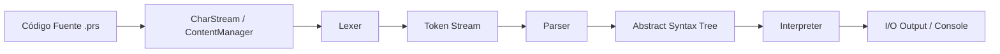

# Arquitectura del Sistema

El proyecto **CNC (PrintScript Engine)** está diseñado bajo una arquitectura modular y fuertemente desacoplada para procesar, validar y ejecutar código fuente de PrintScript.

---

## Flujo de Procesamiento

El ciclo de vida de ejecución de un script sigue el pipeline de un intérprete/compilador:

1. **Lectura**: El código fuente se carga a través de `ContentManager` y se transforma en un flujo de caracteres `CharStream`.
2. **Tokenización**: El `Lexer` consume el stream de caracteres y genera una secuencia de `Token`s enriquecidos con su posición (`Position`).
3. **Análisis Sintáctico**: El `Parser` valida la secuencia de tokens contra las reglas gramaticales y genera el `AST`.
4. **Ejecución / Análisis**: El `Interpreter` (o herramientas como `Formatter` / `Linter`) recorre el AST para ejecutar el programa o realizar transformaciones.

---

## Submódulos y Responsabilidades

| Módulo | Responsabilidad Principal | Dependencias |
| :--- | :--- | :--- |
| **`:common`** | Clases base, gestión de posiciones (`Position`), manejo de flujos de texto (`CharStream`), y tipo funcional `Result<T>`. | *Ninguna* |
| **`:token`** | Definición de tipos de token (`TokenType`), categorías (`Keyword`, `Literal`, `Operator`, `Symbol`) y modelo `Token`. | `:common` |
| **`:lexer`** | Motor de análisis léxico single-pass basado en estructura **Trie** y reglas semánticas modulares. | `:token`, `:common` |
| **`:ast`** | Definición de los nodos del árbol de sintaxis abstracta (`Statement`, `Expression`, `BinaryOp`, etc.). | `:token`, `:common` |
| **`:parser`** | Analizador sintáctico que procesa tokens y construye el AST respetando la gramática y precedencia de operadores. | `:token`, `:ast`, `:common` |
| **`:interpreter`** | Motor de ejecución, manejo de memoria, tabla de símbolos y ámbitos (scopes). | `:ast`, `:token`, `:common` |
| **`:cli`** | Interfaz por línea de comandos, parseo de flags/argumentos, abstracción de I/O (`IOManager`) y comandos registrados. | `:common` |
| **`:app`** | Punto de entrada (`main`) que orquesta la configuración del compilador/intérprete y ejecuta la aplicación. | `:lexer`, `:parser`, `:token`, `:ast`, `:common`, `:cli` |

---

## Decisiones de Diseño

- **Trie Streaming Lexer**: Permite reconocer palabras clave, símbolos compuestos y operadores en una sola pasada sobre el flujo de caracteres.
- **Tipado Funcional con `Result<T>`**: Manejo robusto de errores sin recurrir a excepciones no controladas en el flujo principal.
- **Inmutabilidad**: Tokens y nodos del AST son estructuras inmutables de datos (`data class`), facilitando el testing y garantizando la integridad de los árboles sintácticos.
- **Abstracción de I/O**: El módulo `:cli` y el intérprete interactúan con interfaces desacopladas (`IOManager`, `StdIO`), facilitando pruebas automatizadas sin depender de `System.out` o `System.in`.
