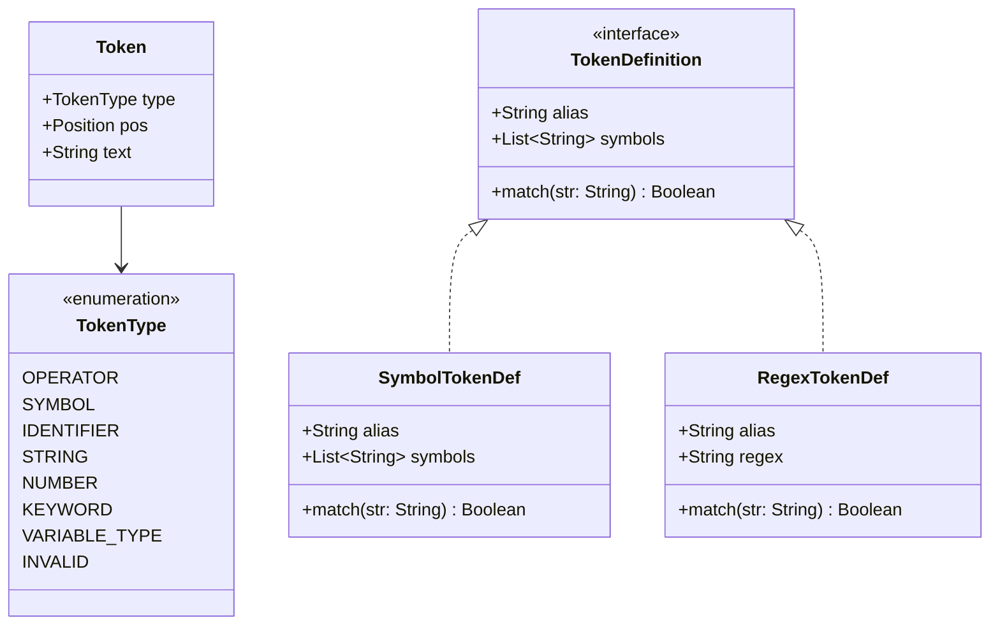

# Módulo: :token

**Ruta:** `/token`  
**Dependencias directas:** `:common`  
**Consumidores:** `:lexer`, `:parser`, `:app`  

---

## 1. Responsabilidad y Propósito (SRP)
- **Qué problema resuelve:** Define el vocabulario léxico fundamental del compilador. Es el modelo de datos atómico que representa las palabras y símbolos con significado sintáctico una vez clasificados por el lexer.
- **Qué hace:**
  - Define la taxonomía de tokens (`TokenType`).
  - Modela la unidad mínima de información con posición de origen (`Token`).
  - Provee abstracciones para definiciones léxicas basadas en literales exactos (`SymbolTokenDef`) o expresiones regulares (`RegexTokenDef`).
- **Qué NO hace (Fronteras):**
  - No escanea caracteres ni contiene algoritmos de tokenización.
  - No valida sintaxis ni verifica reglas gramaticales.

---

## 2. Arquitectura y Componentes Clave

### Diagrama de Componentes


### Entidades de Dominio e Interfaces
1. **`TokenType`:**
   - Categorización del token: `KEYWORD` (ej: `let`), `VARIABLE_TYPE` (ej: `number`, `string`), `IDENTIFIER` (ej: `x`), `NUMBER` (ej: `10`), `STRING` (ej: `"hola"`), `OPERATOR` (ej: `+`, `*`), `SYMBOL` (ej: `;`, `:`, `=`), `INVALID`.
2. **`Token`:**
   - Inmutable: `data class Token(val type: TokenType, val pos: Position, val text: String)`.
   - `pos`: Coordenada bidimensional `(line, column)` de inicio del token en el archivo. La longitud del texto (`text.length`) define el rango completo sin redundancia de memoria.
3. **`TokenDefinition`:**
   - Define el patrón de coincidencia léxica mediante `alias`, `symbols` y `match(str)`.
   - `SymbolTokenDef`: Coincidencia exacta con uno o más literales (ej: operador `+` o `;`).
   - `RegexTokenDef`: Coincidencia basada en expresiones regulares compiladas.

---

## 3. Manejo de Errores y Pipeline Funcional
- **ErrorType asociado:** Si durante la tokenización se encuentra un lexema sin categorizar, el lexer produce `TokenType.INVALID`.
- **Garantías:** Objetos inmutables (`data class Token`). La posición es inmutable y no sufre mutaciones por referencias compartidas.

---

## 4. Ejemplo Práctico Autónomo (End-to-End)

```kotlin
package example

import cnc.common.Position
import cnc.token.*

fun main() {
    // 1. Instanciación de un Token
    val pos = Position(line = 0, column = 4)
    val token = Token(
        type = TokenType.IDENTIFIER,
        pos = pos,
        text = "miVariable"
    )

    println("Token: $token")
    println("Tipo: ${token.type}, En: (${token.pos.line}:${token.pos.column}), Texto: '${token.text}'")

    // 2. Definición léxica por símbolo exacto
    val asignacion = SymbolTokenDef("assign", "=")
    println("¿Coincide '=' con asignación?: ${asignacion.match("=")}")   // true
    println("¿Coincide '==' con asignación?: ${asignacion.match("==")}") // false

    // 3. Definición léxica por Regex
    val patronNumero = RegexTokenDef("entero", "[0-9]+")
    println("¿Es '123' número?: ${patronNumero.match("123")}") // true
    println("¿Es 'abc' número?: ${patronNumero.match("abc")}") // false
}
```

---

## 5. Integración en el Pipeline del Compilador
- **Entrada:** Producido directamente por las reglas del módulo `:lexer` a medida que consumen caracteres del `CharCursor`.
- **Salida:** Secuencia perezosa `Sequence<Token>` consumida por el cursor de tokens del `:parser`.

---

## 6. Decisiones Técnicas y Tradeoffs
- **Posición de Inicio Única (`pos`):** En lugar de almacenar una tupla de inicio y fin (`startPosition`, `endPosition`), se guarda únicamente la posición inicial. Esto ahorra 50% de las instancias de `Position` en memoria durante el análisis de proyectos grandes, ya que la columna final es simplemente `pos.column + text.length`.
