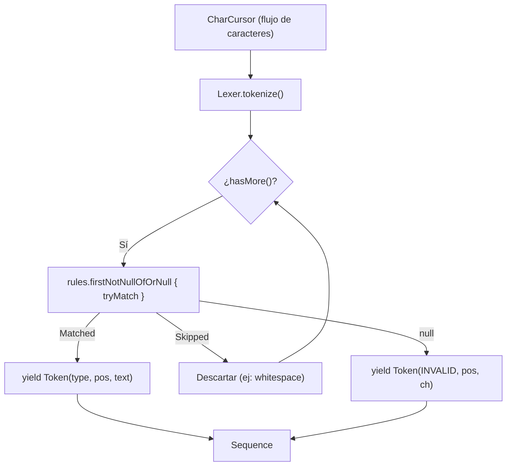

# Módulo: :lexer

**Ruta:** `/lexer`  
**Dependencias directas:** `:common`, `:token`  
**Consumidores:** `:app`  

---

## 1. Responsabilidad y Propósito (SRP)
- **Qué problema resuelve:** Transforma un flujo continuo y perezoso de caracteres (`CharCursor`) en una secuencia de tokens (`Sequence<Token>`) clasificados y con coordenadas 2D exactas, descartando delimitadores irrelevantes (espacios en blanco, saltos de línea) y reconociendo palabras clave y símbolos de forma determinista mediante árboles de prefijos (Trie).
- **Qué hace:**
  - Consume caracteres del `CharCursor` bajo demanda mediante el generador `sequence { ... }`.
  - Evalúa reglas modulares de tokenización (`LexerRule`).
  - Provee soporte para literales delimitados (`"..."`, `'...'`), números enteros, identificadores y palabras clave.
  - Implementa un árbol Trie de coincidencia más larga (*longest prefix match*) para operadores y símbolos compuestos (ej: diferencia `*` de `**`, o `=` de `==`).
  - Emite `TokenType.INVALID` ante caracteres no reconocibles sin arrojar excepciones.
- **Qué NO hace (Fronteras):**
  - No valida orden o coherencia gramatical (responsabilidad del `:parser`).
  - No almacena todos los tokens en memoria de una sola vez (es 100% streaming).

---

## 2. Arquitectura y Componentes Clave

### Diagrama de Componentes


### Entidades de Dominio e Interfaces
1. **`Lexer`:**
   - Orquestador del análisis léxico: `fun tokenize(cursor: CharCursor): Sequence<Token>`.
2. **`LexerRule`:**
   - Interfaz funcional: `fun tryMatch(cursor: Cursor<Char>): RuleResult?`.
   - Si no coincide con la posición actual, retorna `null` sin consumir nada.
   - Si coincide, consume los caracteres correspondientes y retorna un `RuleResult`.
3. **`RuleResult`:**
   - `Matched(val type: TokenType, val text: String)`: Emite un nuevo token.
   - `Skipped`: Caracteres consumidos pero descartados del AST (espacios, comentarios).
4. **`StandardRules`:**
   - Catálogo de fábricas de reglas comunes:
     - `whitespace()`: Consume espacios, tabulaciones y saltos de línea (`Skipped`).
     - `doubleQuotedString(type)`: Cadenas entre comillas dobles con escape `\`.
     - `integerNumber(type)`: Secuencia contigua de dígitos.
     - `standardIdentifier(keywords)`: Identificadores `[a-zA-Z_][a-zA-Z0-9_]*` y mapeo a keywords.
     - `symbols(map)`: Respaldado por `TrieRule` para resolución $O(K)$ de operadores.
5. **`Trie` y `TrieRule`:**
   - Árbol de prefijos para resolución de operadores de longitud variable garantizando la regla de la coincidencia más larga.

---

## 3. Manejo de Errores y Pipeline Funcional
- **ErrorType asociado:** Produce `Token` con `TokenType.INVALID` cuando ningún lexema es reconocido por ninguna regla.
- **Garantías:** Cero excepciones. El cursor nunca queda bloqueado; si una regla no coincide, no altera el cursor; si ninguna regla reconoce el caracter, el `Lexer` avanza 1 posición y emite `INVALID`, permitiendo al compilador continuar el análisis de los tokens posteriores.

---

## 4. Ejemplo Práctico Autónomo (End-to-End)

```kotlin
package example

import cnc.common.asCharCursor
import cnc.lexer.Lexer
import cnc.lexer.rules.StandardRules
import cnc.token.TokenType

fun main() {
    // 1. Configurar reglas léxicas
    val keywords = mapOf(
        "let" to TokenType.KEYWORD,
        "number" to TokenType.VARIABLE_TYPE
    )

    val symbols = mapOf(
        "=" to TokenType.SYMBOL,
        ";" to TokenType.SYMBOL,
        "+" to TokenType.OPERATOR,
        "**" to TokenType.OPERATOR
    )

    val lexer = Lexer(
        StandardRules.whitespace(),
        StandardRules.doubleQuotedString(TokenType.STRING),
        StandardRules.integerNumber(TokenType.NUMBER),
        StandardRules.standardIdentifier(keywords = keywords),
        StandardRules.symbols(symbols)
    )

    // 2. Tokenizar código fuente
    val sourceCode = """
        let x: number = 42 ** 2;
        let msg = "hola mundo";
    """.trimIndent()

    val tokens = lexer.tokenize(sourceCode.asCharCursor())

    for (token in tokens) {
        println("${token.pos.line}:${token.pos.column}\t[${token.type}]\t'${token.text}'")
    }
}
```

---

## 5. Integración en el Pipeline del Compilador
- **Entrada:** `CharCursor` originado por el `:common` a través de `ContentManager.openStream()`.
- **Salida:** `Sequence<Token>` consumida directamente por el `:parser`.

---

## 6. Decisiones Técnicas y Tradeoffs
- **Lazy Evaluation (`Sequence`):** Los tokens no se procesan en lote en memoria. Se emiten bajo demanda a medida que el parser los solicita, permitiendo compilar archivos masivos con consumo de memoria $O(1)$.
- **Coincidencia más Larga mediante Trie:** Resuelve ambigüedades como `**` vs `*` o `==` vs `=` en tiempo lineal respecto a la longitud del símbolo ($O(K)$) sin retroceso innecesario.
