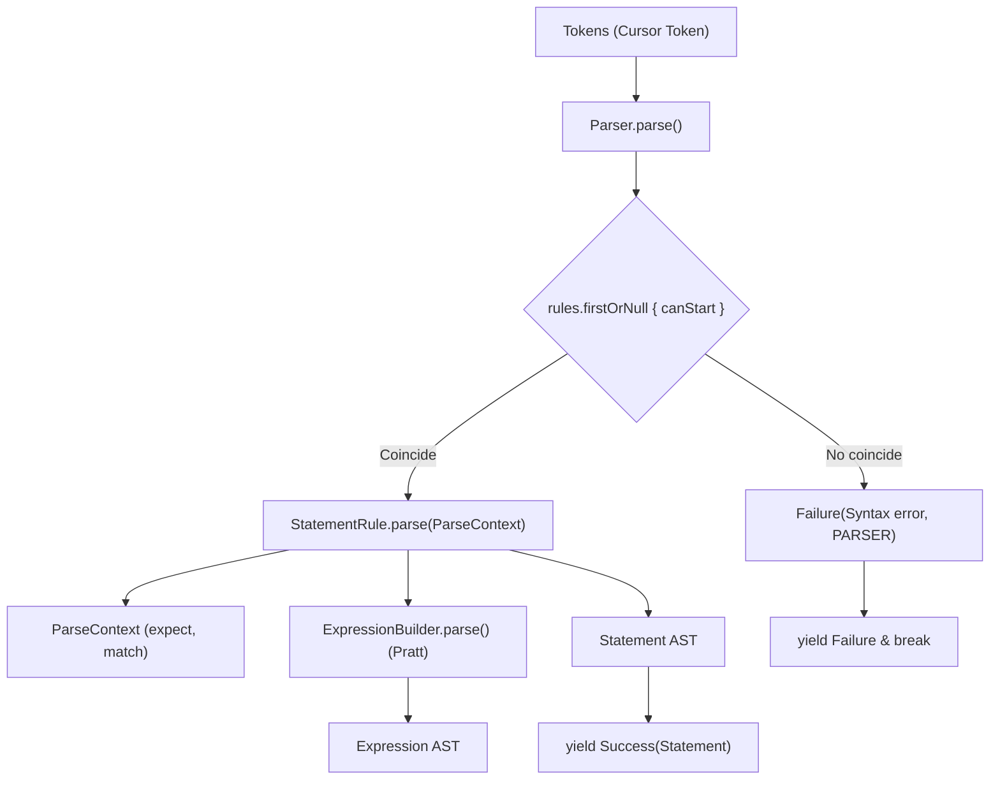

# Módulo: :parser

**Ruta:** `/parser`  
**Dependencias directas:** `:common`, `:token`, `:ast`  
**Consumidores:** `:app`  

---

## 1. Responsabilidad y Propósito (SRP)
- **Qué problema resuelve:** Transforma el flujo secuencial de tokens (`Sequence<Token>`) en un flujo estructurado de sentencias sintácticas (`Sequence<Result<Statement>>`). Combina un motor predictivo $LL(2)$ para sentencias con un algoritmo de precedencia de operadores (Pratt Parser) para expresiones aritméticas y compuestas.
- **Qué hace:**
  - Implementa el parser continuo con semántica *fail-fast* sobre `Cursor<Token>`.
  - Provee la interfaz extensible `StatementRule<T>` con predicados de inicio `canStart(cursor)`.
  - Expone el contexto de parseo `ParseContext` con operaciones de coincidencia declarativas (`expect`, `match`, `parseExpression`).
  - Provee las reglas estándar de PrintScript 1.0 (`declarationRule`, `assignmentRule`, `callRule`).
  - Construye expresiones respetando precedencia y asociatividad mediante `ExpressionBuilder` (Pratt).
- **Qué NO hace (Fronteras):**
  - No valida tipos estáticos ni existencia de variables en la tabla de símbolos (responsabilidad de `:semantic`).
  - No evalúa ni ejecuta código (responsabilidad de `:interpreter`).

---

## 2. Arquitectura y Componentes Clave

### Diagrama de Arquitectura


### Entidades de Dominio e Interfaces
1. **`Parser`:**
   - Orquestador del análisis sintáctico: `fun parse(tokens: Sequence<Token>): Sequence<Result<Statement>>`.
   - Si una sentencia falla sintácticamente, emite `Failure` y finaliza la secuencia limpiamente.
2. **`StatementRule<T : Statement>`:**
   - Contrato declarativo de regla de sentencia:
     - `val tag: String`: Identificador de la regla.
     - `fun canStart(cursor: Cursor<Token>): Boolean`: Predicado $LL(2)$ que inspecciona `peek(0)` y `peek(1)` sin consumir.
     - `fun parse(cursor, expressionParser): Result<T>`.
3. **`ParseContext`:**
   - DSL dentro de `statementRule { ... }`:
     - `expect(type, text)`: Consume el token si coincide; si no coincide, aborta la regla con un `Failure` contextualizado.
     - `match(type, text)`: Consume y retorna `true` si coincide; `false` si no.
     - `parseExpression()`: Invoca recursivamente al motor Pratt.
4. **`ExpressionBuilder`:**
   - Motor Pratt: configura recetas para hojas (`NUMBER`, `STRING`, `IDENTIFIER`) y operadores con precedencia y asociatividad (`LEFT` / `RIGHT`).

---

## 3. Manejo de Errores y Pipeline Funcional
- **ErrorType asociado:** `ErrorType.PARSER`.
- **Garantías:** Cero excepciones no capturadas. Los abortos sintácticos (`ParseAbortException`) son internos y se capturan dentro de la regla para emitir `Failure(msg, ErrorType.PARSER)`.

---

## 4. Ejemplo Práctico Autónomo (End-to-End)

```kotlin
package example

import cnc.ast.*
import cnc.common.Success
import cnc.common.asCharCursor
import cnc.lexer.Lexer
import cnc.lexer.rules.StandardRules
import cnc.parser.Parser
import cnc.parser.expression.Associativity
import cnc.parser.expression.ExpressionBuilder
import cnc.parser.expression.OperatorDef
import cnc.parser.rule.StandardStatementRules
import cnc.token.Token
import cnc.token.TokenType

fun main() {
    // 1. Configurar ExpressionBuilder (Pratt)
    val exprParser = ExpressionBuilder(
        recipes = mapOf(
            "num" to { token: Token -> NumberLiteral(token.text.toDouble()) },
            "id" to { token: Token -> Identifier(token.text) }
        ),
        operators = listOf(
            OperatorDef("+", precedence = 1),
            OperatorDef("*", precedence = 2),
            OperatorDef("**", precedence = 3, associativity = Associativity.RIGHT)
        )
    )

    // 2. Configurar Parser con reglas estándar
    val parser = Parser(
        rules = StandardStatementRules.printScript10,
        expressionParser = exprParser
    )

    // 3. Parsear tokens simulados
    val lexer = Lexer(
        StandardRules.whitespace(),
        StandardRules.integerNumber(),
        StandardRules.standardIdentifier(
            keywords = mapOf("let" to TokenType.KEYWORD, "number" to TokenType.VARIABLE_TYPE)
        ),
        StandardRules.symbols(mapOf(":" to TokenType.SYMBOL, "=" to TokenType.SYMBOL, ";" to TokenType.SYMBOL, "+" to TokenType.OPERATOR, "*" to TokenType.OPERATOR))
    )

    val tokens = lexer.tokenize("let x: number = 10 + 2 * 3;".asCharCursor())
    val statements = parser.parse(tokens)

    for (result in statements) {
        when (result) {
            is Success -> {
                val stmt = result.data
                println("Sentencia parseada con éxito: $stmt")
                // Declaration(name=x, type=number, value=BinaryExpression(...), isMutable=true)
            }
            is cnc.common.Failure -> {
                println("Error de sintaxis: [${result.type}] ${result.msg}")
            }
        }
    }
}
```

---

## 5. Integración en el Pipeline del Compilador
- **Entrada:** `Sequence<Token>` provista por el `:lexer`.
- **Salida:** `Sequence<Result<Statement>>` consumida por el analizador de tipos `:semantic`.

---

## 6. Decisiones Técnicas y Tradeoffs
- **Predicción $LL(2)$ Determinista:** La inspección de a lo sumo dos tokens (`canStart(peek 0, peek 1)`) elimina el backtracking costoso y permite saber de inmediato qué regla ejecutar (ej: `let` $\rightarrow$ Declaración, `id` seguido de `=` $\rightarrow$ Asignación, `id` seguido de `(` $\rightarrow$ Llamada).
- **Pratt Parser para Expresiones:** Separa limpiamente la estructura de alto nivel de las sentencias del cálculo de precedencias y asociatividad matemática de las expresiones.
