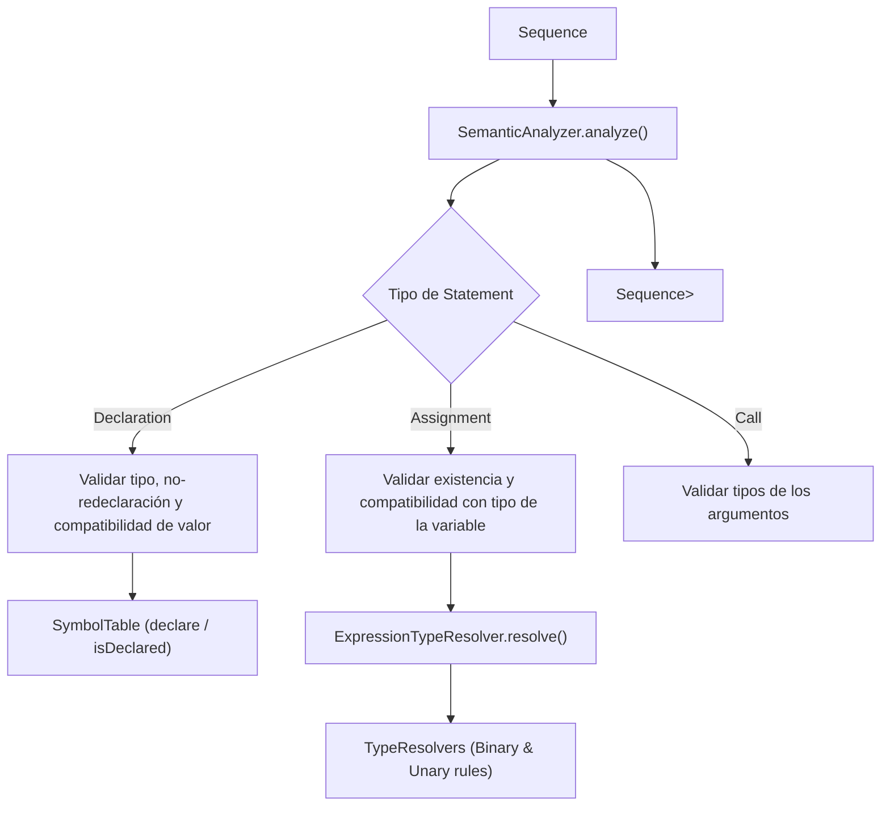

# Módulo: :semantic

**Ruta:** `/semantic`  
**Dependencias directas:** `:common`, `:ast`  
**Consumidores:** `:app`  

---

## 1. Responsabilidad y Propósito (SRP)
- **Qué problema resuelve:** Realiza la comprobación estática de tipos (*type-checking*), la verificación de alcance de identificadores (*scope checking*), previene la redeclaración de variables y asegura la compatibilidad entre tipos en asignaciones y operaciones binarias y unarias.
- **Qué hace:**
  - Valida sentencias `Declaration`, `Assignment` y `Call`.
  - Mantiene la tabla de símbolos (`SymbolTable`) con los tipos válidos y variables registradas.
  - Resuelve recursivamente el tipo estático de cualquier expresión (`ExpressionTypeResolver`).
  - Provee resolvedores de tipos estándar (`TypeResolvers`: suma/concatenación, aritmética estricta, operadores unarios).
  - Emite errores semánticos funcionales (`ErrorType.SEMANTIC`).
- **Qué NO hace (Fronteras):**
  - No ejecuta sentencias ni calcula valores numéricos/texto en tiempo de ejecución.
  - No re-analiza sintaxis ni consume tokens directamente.

---

## 2. Arquitectura y Componentes Clave

### Diagrama de Arquitectura


### Entidades de Dominio e Interfaces
1. **`SemanticAnalyzer`:**
   - Analizador principal: `fun analyze(statements: Sequence<Statement>): Sequence<Result<Statement>>`.
   - Emite `Success(statement)` si la sentencia es semánticamente correcta, o `Failure` si viola alguna regla de tipos o alcance.
2. **`SemanticContext`:**
   - Interfaz de contexto: `isValidType(type)`, `isDeclared(name)`, `declare(name, type)`, `typeOf(name)`, `resolveExpressionType(expr)`.
   - `DefaultSemanticContext`: Implementación estándar que conecta `SymbolTable`, `BinaryOpResolver`, `UnaryOpResolver` y `ExpressionTypeRule`.
3. **`SymbolTable`:**
   - Almacén de tipos válidos y mapeo de variables declaradas a sus tipos estáticos (`Map<String, String>`).
4. **`TypeResolvers`:**
   - Fábricas de reglas de compatibilidad de tipos:
     - `additionOrConcat`: `number + number = number`, `string + anything = string`.
     - `numericOnly(op)`: `-`, `*`, `/` exigen estrictamente `number` en ambos operandos.
     - `unaryNumeric(op)`: Operador `-` unario exige `number`.
5. **`ExpressionTypeResolver`:**
   - Infiere recursivamente el tipo estático (`"number"`, `"string"`) de un árbol de `Expression`.

---

## 3. Manejo de Errores y Pipeline Funcional
- **ErrorType asociado:** `ErrorType.SEMANTIC`.
- **Garantías:** Cero excepciones. Errores tales como: variable ya declarada, variable no declarada, tipo no reconocido, o incompatibilidad de tipos (ej: asignar `"texto"` a una variable `number`) son modelados como `Failure("...", ErrorType.SEMANTIC)`.

---

## 4. Ejemplo Práctico Autónomo (End-to-End)

```kotlin
package example

import cnc.ast.*
import cnc.common.Failure
import cnc.common.Success
import cnc.semantic.*

fun main() {
    // 1. Configurar contexto semántico
    val symbolTable = SymbolTable(validTypes = setOf("number", "string"))
    val binaryRules = mapOf(
        "+" to TypeResolvers.additionOrConcat,
        "*" to TypeResolvers.numericOnly("*")
    )
    val context = DefaultSemanticContext(
        symbolTable = symbolTable,
        binaryRules = binaryRules
    )
    val analyzer = SemanticAnalyzer(context)

    // 2. Analizar sentencias válidas
    val sentenciasValidas = sequenceOf(
        Declaration("x", "number", NumberLiteral(10.0)),
        Declaration("y", "number", BinaryExpression(Identifier("x"), "*", NumberLiteral(2.0)))
    )

    for (res in analyzer.analyze(sentenciasValidas)) {
        when (res) {
            is Success -> println("Semántica OK: ${res.data}")
            is Failure -> println("Error semántico: ${res.msg}")
        }
    }

    // 3. Analizar sentencia con error de tipos (asignar string a number)
    val sentenciaInvalida = sequenceOf(
        Declaration("z", "number", StringLiteral("esto no es un numero"))
    )

    for (res in analyzer.analyze(sentenciaInvalida)) {
        when (res) {
            is Success -> println("Semántica OK: ${res.data}")
            is Failure -> println("Error capturado: [${res.type}] ${res.msg}")
            // Error capturado: [SEMANTIC] Se esperaba 'number' pero se obtuvo 'string'
        }
    }
}
```

---

## 5. Integración en el Pipeline del Compilador
- **Entrada:** `Sequence<Statement>` validada sintácticamente por el `:parser`.
- **Salida:** `Sequence<Result<Statement>>` validada con tipos estáticos, consumida por el `:interpreter`.

---

## 6. Decisiones Técnicas y Tradeoffs
- **Reglas de Operación Componibles:** En lugar de codificar la lógica de compatibilidad de tipos dentro de un `when` gigante en el analizador, cada operador (`+`, `-`, `*`, `/`) se inyecta como un `BinaryOpResolver`. Esto permite agregar fácilmente nuevos operadores (ej: `%`, `**`, `==`) o dialectos sin alterar el motor principal.
