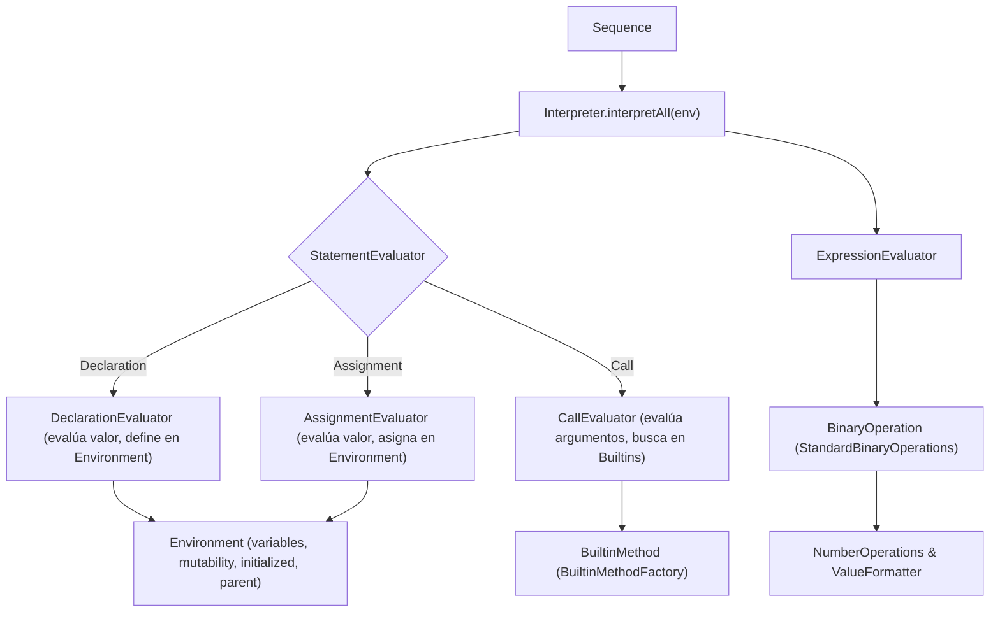

# Módulo: :interpreter

**Ruta:** `/interpreter`  
**Dependencias directas:** `:common`, `:ast`  
**Consumidores:** `:app`  

---

## 1. Responsabilidad y Propósito (SRP)
- **Qué problema resuelve:** Ejecuta las sentencias y evalúa las expresiones del AST de PrintScript, administrando el estado en memoria de las variables a través de entornos con ámbitos jerárquicos (scoping léxico), controlando la mutabilidad (`const` vs `let`), garantizando cero excepciones no controladas mediante `Result<T>` (`ErrorType.RUNTIME`), formateando la salida de forma canónica (`ValueFormatter`) y proveyendo un sistema extensible de funciones integradas (`BuiltinMethod`).
- **Qué hace:**
  - Administra el almacenamiento de variables, su mutabilidad y su estado de inicialización en `Environment`.
  - Evalúa expresiones aritméticas, unarias y literales con `ExpressionEvaluator`.
  - Ejecuta declaraciones, asignaciones y llamadas a funciones con `StatementEvaluator`.
  - Provee una fábrica fluida de métodos builtin (`BuiltinMethodFactory.builder()`).
  - Provee presets de inicialización inmediata (`InterpreterPresets.v1_0()`) y un `InterpreterBuilder` fluido.
  - Ofrece streaming fail-fast con `interpretAll()`.
- **Qué NO hace (Fronteras):**
  - No realiza chequeo estático de tipos ni valida sintaxis.
  - No escribe directamente a `System.out` de forma fija sin permitir la inyección de un sink de salida configurable.

---

## 2. Arquitectura y Componentes Clave

### Diagrama de Arquitectura


### Entidades de Dominio e Interfaces
1. **`Environment`:**
   - Ámbitos léxicos: `class Environment(private val parent: Environment? = null)`.
   - `define(name, value, isMutable, isInitialized): Result<Unit>`
   - `get(name): Result<Any?>`: Retorna `Failure` si no fue inicializada o no existe.
   - `assign(name, value): Result<Unit>`: Retorna `Failure` si la variable es inmutable (`isMutable = false`).
   - `createChild(): Environment`: Crea un sub-entorno hijo que puede sombrear (*shadow*) variables padre.
2. **`BuiltinMethod` y `BuiltinMethodFactory`:**
   - Interfaz: `val name: String; fun execute(arguments: List<Any?>): Result<Any?>`.
   - `BuiltinMethodBuilder`: API fluida `.name("print").execute { ... }.build()`.
   - `BuiltinMethodFactory`: Preconfiguraciones para `println(output)`, `readInput(input)`, `readEnv(envProvider)`.
3. **`ValueFormatter`:**
   - Canonicidad de valores: enteros sin coma flotante (`5.0` $\rightarrow$ `"5"`), decimales con punto (`5.25`), cadenas sin comillas, booleanos.
4. **`Interpreter`:**
   - `interpret(statement, environment): Result<Unit>`
   - `interpret(statements, environment): Result<Unit>`
   - `interpretAll(statements, environment): Sequence<Result<Unit>>` (perezoso y fail-fast).
   - `evaluate(expression, environment): Result<Any?>`
5. **`InterpreterPresets` e `InterpreterBuilder`:**
   - `InterpreterPresets.v1_0(output)`: Construcción out-of-the-box para PrintScript 1.0.
   - `InterpreterBuilder`: Registro desacoplado de operaciones binarias, evaluadores y métodos builtin.

---

## 3. Manejo de Errores y Pipeline Funcional
- **ErrorType asociado:** `ErrorType.RUNTIME` / `ErrorType.INTERPRETER`.
- **Garantías:** Cero excepciones en tiempo de ejecución. Casos como división por cero, variable no declarada, variable no inicializada, reasignación de constante inmutable o función desconocida son modelados con `Failure("...", ErrorType.RUNTIME)`.

---

## 4. Ejemplo Práctico Autónomo (End-to-End)

```kotlin
package example

import cnc.ast.*
import cnc.common.Failure
import cnc.common.Success
import cnc.interpreter.*

fun main() {
    // 1. Configurar intérprete con captura de salida en buffer
    val salida = mutableListOf<String>()
    val interpreter = InterpreterPresets.v1_0 { salida.add(it) }
    val env = Environment()

    // 2. Ejecutar un programa:
    // const c: number = 100;
    // let x: number = c / 2;
    // println("Resultado:", x);
    val programa = listOf(
        Declaration(name = "c", type = "number", value = NumberLiteral(100.0), isMutable = false),
        Declaration(name = "x", type = "number", value = BinaryExpression(Identifier("c"), "/", NumberLiteral(2.0)), isMutable = true),
        Call(function = "println", arguments = listOf(StringLiteral("Resultado:"), Identifier("x")))
    )

    for (result in interpreter.interpretAll(programa, env)) {
        when (result) {
            is Success -> Unit
            is Failure -> println("Error de ejecución: [${result.type}] ${result.msg}")
        }
    }

    println("Salida capturada: ${salida.first()}") // "Resultado: 50"

    // 3. Demostración de prevención de reasignación a inmutable
    val reasignacionInvalida = Assignment(target = "c", value = NumberLiteral(999.0))
    val resultadoFallo = interpreter.interpret(reasignacionInvalida, env)
    if (resultadoFallo is Failure) {
        println("Fallo controlado: [${resultadoFallo.type}] ${resultadoFallo.msg}")
        // Fallo controlado: [RUNTIME] Cannot reassign to immutable variable 'c'
    }
}
```

---

## 5. Integración en el Pipeline del Compilador
- **Entrada:** `Sequence<Statement>` que ha superado el análisis semántico en `:semantic`.
- **Salida:** Efectos de ejecución colaterales controlados (I/O, llamadas a builtins) y estado de variables en el `Environment`.

---

## 6. Decisiones Técnicas y Tradeoffs
- **Patrón Builder/Factory para Builtins:** Evita hardcodear métodos específicos en los evaluadores, permitiendo inyectar dependencias de I/O para pruebas unitarias sin tocar la lógica central.
- **Fail-Fast Streaming con `Sequence`:** `interpretAll()` suspende y detiene la ejecución inmediatamente en el primer `Failure`, preservando la integridad del estado de las variables.
