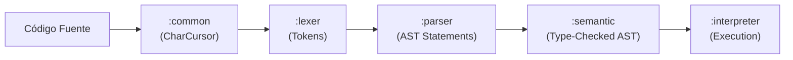

# Índice de Módulos de PrintScript (CNC)

Documentación técnica y operativa completa de la arquitectura de compilación de **PrintScript (CNC)**. Cada informe sigue un template estandarizado con responsabilidades, diagramas Mermaid, manejo de errores, ejemplos de código 100% autónomos y decisiones de diseño.

---

## Módulos del Sistema

| # | Módulo | Responsabilidad Principal | Informe Detallado |
|---|---|---|---|
| 1 | **`:common`** | Primitivas base, `Result<T>`, `Cursor<T>`, `CharCursor`, `ContentManager` | [01-common.md](./01-common.md) |
| 2 | **`:token`** | Vocabulario léxico, `Token`, `TokenType`, definiciones por regex o símbolo | [02-token.md](./02-token.md) |
| 3 | **`:lexer`** | Tokenización perezosa de caracteres con Trie para operadores | [03-lexer.md](./03-lexer.md) |
| 4 | **`:ast`** | Árbol de sintaxis abstracta inmutable (`Statement` y `Expression`) | [04-ast.md](./04-ast.md) |
| 5 | **`:parser`** | Parsing predictivo $LL(2)$ y parsing de precedencia de operadores Pratt | [05-parser.md](./05-parser.md) |
| 6 | **`:semantic`** | Comprobación estática de tipos, tabla de símbolos y chequeo de ámbito | [06-semantic.md](./06-semantic.md) |
| 7 | **`:interpreter`** | Ejecución en memoria, `Environment` con scoping léxico, mutabilidad y builtins | [07-interpreter.md](./07-interpreter.md) |
| 8 | **`:cli`** | Infraestructura de comandos interactiva/no interactiva, flags y ayuda | [08-cli.md](./08-cli.md) |
| 9 | **`:app`** | Orquestador raíz (`Compiler`, `Config`), punto de entrada y configuraciones | [09-app.md](./09-app.md) |

---

## Flujo del Pipeline

