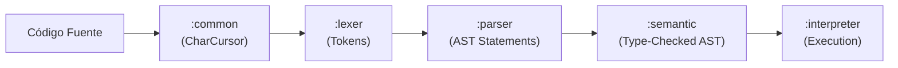

# Índice de Módulos de PrintScript (CNC)

Documentación técnica y operativa completa de la arquitectura de compilación de **PrintScript (CNC)**. Cada informe sigue un template estandarizado con responsabilidades, diagramas Mermaid, manejo de errores, ejemplos de código 100% autónomos y decisiones de diseño.

---

## Módulos del Sistema

| # | Módulo | Responsabilidad Principal | Informe Detallado |
|---|---|---|---|
| 1 | **`:common`** | Primitivas base, `Result<T>`, `Cursor<T>`, `CharCursor`, `ContentManager` | [common/README.md](../../common/README.md) |
| 2 | **`:token`** | Vocabulario léxico, `Token`, `TokenType`, definiciones por regex o símbolo | [token/README.md](../../token/README.md) |
| 3 | **`:lexer`** | Tokenización perezosa de caracteres con Trie para operadores | [lexer/README.md](../../lexer/README.md) |
| 4 | **`:ast`** | Árbol de sintaxis abstracta inmutable (`Statement` y `Expression`) | [ast/README.md](../../ast/README.md) |
| 5 | **`:parser`** | Parsing predictivo $LL(2)$ y parsing de precedencia de operadores Pratt | [parser/README.md](../../parser/README.md) |
| 6 | **`:semantic`** | Comprobación estática de tipos, tabla de símbolos y chequeo de ámbito | [semantic/README.md](../../semantic/README.md) |
| 7 | **`:interpreter`** | Ejecución en memoria, `Environment` con scoping léxico, mutabilidad y builtins | [interpreter/README.md](../../interpreter/README.md) |
| 8 | **`:cli`** | Infraestructura de comandos interactiva/no interactiva, flags y ayuda | [cli/README.md](../../cli/README.md) |
| 9 | **`:app`** | Orquestador raíz (`Compiler`, `Config`), punto de entrada y configuraciones | [app/README.md](../../app/README.md) |

---

## Flujo del Pipeline

