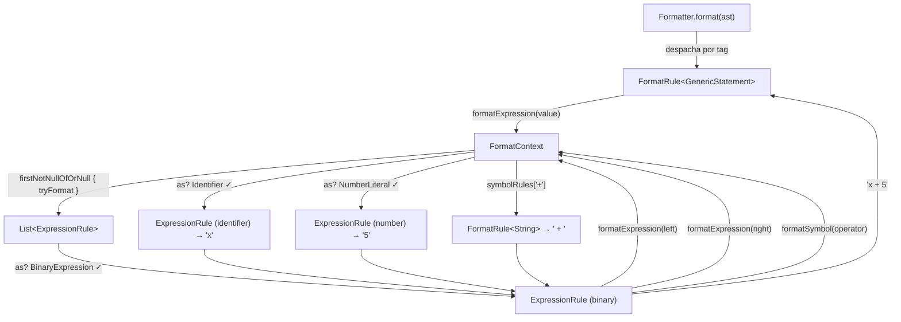
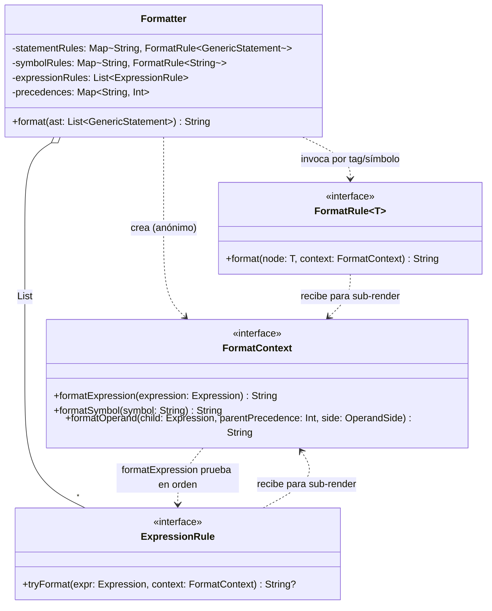

# Planificación — Formatter de PrintScript

> Documento vivo. Registra las decisiones de diseño acordadas para el módulo
> `:formatter`. Se actualiza a medida que evoluciona la discusión.

---

## Objetivo

Crear una herramienta que **formatee** código PrintScript aplicando reglas de
estilo configurables, produciendo una salida canónica independientemente de
cómo venga escrito el código de entrada.

---

## Decisión 1 — El formatter consume el AST, no texto crudo

El formatter es un **consumidor del AST**, hermano del intérprete y del análisis
semántico. No es un preprocesador de texto previo al lexer.

Flujo:

```
Texto fuente (desprolijo)
   │
   ▼
ContentManager ──► Lexer ──► Parser ──► AST (List<GenericStatement>)
                                         │
                                         ├──► [Formatter]     → texto prolijo
                                         └──► [Interpreter]   → ejecución
```

Motivo: para formatear bien hay que entender la estructura (dónde va cada `;`,
`:`, operador). Trabajar sobre texto crudo obligaría a reimplementar un
mini-parser dentro del formatter. Reutilizar el AST evita esa duplicación y
sigue lo que hace la industria (Prettier, gofmt, ktlint).

La arquitectura del proyecto ya lo anticipa (`docs/architecture.md`):
> "El `Interpreter` (o herramientas como `Formatter` / `Linter`) recorre el AST
> para ejecutar el programa o realizar transformaciones."

## Decisión 2 — Para qué sirve formatear "antes de consumir"

Formatear **no cambia** lo que el intérprete hace: el AST de
`let x:number=5+3*2;` y el de `let x: number = 5 + 3 * 2;` es idéntico. El valor
del formatter es para el **desarrollador y el flujo de trabajo**, no para el
motor de ejecución:

- Consistencia de estilo (higiene de código, `format-on-save`).
- Comando independiente, no un paso obligatorio del pipeline
  (`format` vs `run` vs `validate`).
- Verificación de estilo en CI (formato idempotente como *gate*).

"Formatear antes de consumir" es válido como **flujo de usuario** (formateo y
luego ejecuto), no como transformación interna del pipeline de ejecución.

## Decisión 3 — Retorno del formatter: `String`

El formatter devuelve un `String` (no un `ContentManager`).

Motivo: separación de responsabilidades. Formatear produce texto; qué se hace
con ese texto (envolver en `StrContent`, escribir a archivo, imprimir) es
decisión del que llama. Envolver el resultado en `StrContent(resultado)` es
trivial en el punto de uso y permite re-alimentar el pipeline si se desea.

## Decisión 4 — Configuración basada en una lista de rules

El formatter **no** recibe un set fijo de flags booleanos. Recibe una
**lista de reglas de formato** (`List<FormatRule>`), coherente con el resto del
proyecto:

- `:lexer` recibe `List<LexerRule>`
- `:parser` recibe `List<Grammar>`
- `:formatter` recibirá `List<FormatRule>`

El motor del formatter no conoce las reglas concretas: se inyectan. Esto permite
agregar, quitar o reordenar reglas de estilo sin modificar el núcleo. La
configuración se define como **código Kotlin en `app/config/`** (ver Decisión 8),
igual que el resto del proyecto.

### Interfaz resuelta — dos familias de reglas, dos mapas

El formatter opera sobre el **AST**, donde ya no existen tokens: las expresiones
guardan el operador como `String` (`BinaryExpression.operator`) y los statements
son `GenericStatement` = `tag: String` + `Fields`. Por eso las reglas **no** se
mapean por `Token`, sino por lo que sí existe en el AST. Se identificaron **dos
familias** de reglas, cada una con su propio mapa (no un mapa único mezclado,
para no forzar una interfaz común artificial ni colisionar espacios de nombres):

```kotlin
// Nivel 1 — estructura completa del statement (llave = tag)
Map<String, StatementRule>   // "VariableDeclaration" -> regla estructural

// Nivel 2 — micro-formato de símbolos/operadores (llave = símbolo)
Map<String, SymbolRule>      // ":" -> sin espacio antes + espacio después
                             // "=" -> espacio a ambos lados
```

- **`StatementRule` (por `tag`)**: define la *forma* del statement
  (`let _ : _ = _ ;`). No hardcodea espaciado: delega en las `SymbolRule`.
- **`SymbolRule` (por símbolo)**: fuente única de verdad del espaciado fino de
  cada símbolo/operador, reutilizada por todos los statements que lo usen.
- Ambos mapas se **inyectan desde `app/config/`** (patrón idéntico a
  `Lexer(rules)` / `Parser(grammars)`). El motor `:formatter` no conoce
  PrintScript.

## Decisión 5 — Dos fases anidadas: `general` (tag) → `specific` (symbol)

El formateo ocurre en **una sola pasada** sobre el AST, con dos niveles anidados:

- **Fase `general`** (nivel externo): recorre `List<GenericStatement>` y despacha
  cada uno por `tag` a su `StatementRule`, que construye la forma del statement.
- **Fase `specific`** (nivel interno): *mientras* la fase general construye la
  forma, invoca la `SymbolRule` correspondiente en cada símbolo emitido (`:`,
  `=`, `;`, operadores) para resolver el espaciado.

No son dos pasadas sobre texto crudo (eso reintroduciría el problema del enfoque
"buffer de texto" descartado). Es un **traversal con delegación**: `general`
orquesta y llama a `specific` en cada símbolo. Las expresiones se resuelven vía
`ExpressionVisitor<String>` como sub-caso dentro de la fase general.

## Decisión 7 — Abstracción unificada `FormatRule<T>`

Se detectó una asimetría en el borrador previo: statements y símbolos pasaban por
reglas configurables e inyectadas, pero el render de expresiones estaba
**hardcodeado** dentro del `ExpressionFormatter`, y cada familia devolvía un tipo
distinto (`String`, `String`, `Spacing`). No había comportamiento común.

Se unifica todo bajo **una sola abstracción genérica**:

```kotlin
fun interface FormatRule<T> {
    fun format(node: T, context: FormatContext): String
}
```

Toda regla toma un pedazo del AST (o un símbolo) + un `FormatContext` y produce
`String`. Con esto:

- `StatementRule`  → `FormatRule<GenericStatement>` (mapeado por `tag`).
- `SymbolRule`     → `FormatRule<String>` (el "nodo" es el texto del símbolo).
- Expresiones      → `FormatRule<T>` por tipo de expresión (deja de estar
  hardcodeado). **El mecanismo de despacho por tipo queda pendiente** (ver
  preguntas abiertas).
- `Spacing` deja de ser un tipo de retorno de primer nivel; a lo sumo queda como
  helper interno que una regla de símbolo usa para construir su `String`.

El `FormatContext` expone las capacidades de sub-render para que cualquier regla
componga sin hardcodear:

```kotlin
interface FormatContext {
    fun formatExpression(expr: Expression): String
    fun formatSymbol(symbol: String): String
}
```

Así una `FormatRule<GenericStatement>` de `VariableDeclaration` se escribe como
pura composición: `formatSymbol("let")` … `formatSymbol(":")` …
`formatExpression(value)` … `formatSymbol(";")`, sin espaciado hardcodeado.

## Decisión 8 — La configuración es código Kotlin, no un archivo externo

La configuración del formatter (los mapas de reglas) se define como **código
Kotlin en `app/config/`**, no como JSON/YAML ni ningún archivo externo. Es el
patrón ya establecido en el proyecto: `Lexer.kt`, `Grammar.kt` y `Token.kt`
arman sus configuraciones (`printScriptRules`, `grammars`, `CncSymbols`, …) como
`val`s de Kotlin inyectados al motor.

Ventajas coherentes con el proyecto: type-safety (las reglas son lambdas/objetos
verificados por el compilador), refactor seguro, y cero infraestructura de
parseo/validación de config. Descarta la pregunta abierta sobre "JSON o YAML".

---

## Modelo de ejecución — reentrada al motor vía `FormatContext`

Cada `FormatRule` recibe un `FormatContext`, que es "el resto del formatter"
visto desde adentro de una regla: el punto de reentrada para renderizar piezas
más chicas. Provee estas capacidades:

- `formatExpression(expr)` → prueba las `ExpressionRule` en orden (self-dispatch)
  y devuelve el render de la primera que aplica.
- `formatSymbol(symbol)` → aplica la `FormatRule<String>` del símbolo (espaciado).
- `formatOperand(child, parentPrecedence, side)` → renderiza un hijo de una
  expresión binaria envolviéndolo en paréntesis si su precedencia lo exige
  (Decisión 10). Centraliza la lógica de parentización.

Con la **Opción A** (la regla recursea sus hijos), una regla de expresión no
renderiza sus sub-expresiones a mano: se las delega al contexto, que vuelve a
entrar al motor. El flujo para `x + 5`:



La recursión (líneas de `ExpressionRule (binary)` de vuelta a `FormatContext`) es
la Opción A: la regla decide bajar, el contexto ejecuta la bajada probando la
lista de reglas en orden.

### Diagrama de clases del módulo `:formatter`



> Nota: las expresiones NO usan `FormatRule<T>` ni el `ExpressionVisitor`; usan
> `ExpressionRule` con self-dispatch por lista (Decisión 9). Statements y símbolos
> sí usan `FormatRule<T>`.

## Decisión 9 — Despacho de expresiones: self-dispatch por lista (chain of responsibility)

Cierra el punto que estaba colgado. Se priorizó **extensibilidad sobre
exhaustividad**. Se evaluaron tres mecanismos:

| Mecanismo | Extensible sin tocar clases | Sin cast | Exhaustividad en compilación |
| :-- | :-: | :-: | :-: |
| `Map<KClass, FormatRule<Expression>>` | sí | **no** (cast) | no |
| Visitor / data class `ExpressionRules` | **no** (agregar campo/método) | sí | sí |
| **`List<ExpressionRule>` self-dispatch** | **sí** | sí (`as?`) | **no** |

Se eligió el tercero: cada regla se **autoevalúa** y devuelve `null` si no aplica;
el motor prueba las reglas en orden y usa la primera no-null.

```kotlin
fun interface ExpressionRule {
    fun tryFormat(expr: Expression, context: FormatContext): String?
}

// selector en FormatContext.formatExpression:
expressionRules.firstNotNullOfOrNull { it.tryFormat(expr, this) }
    ?: error("No ExpressionRule applies to ...")
```

Consecuencias asumidas:

- **El orden de la lista importa**: gana la primera regla que devuelve no-null.
  Para expresiones los `as?` son disjuntos, así que en la práctica no compiten.
- **Falla en runtime, no en compilación**: si falta una regla para un tipo, es
  `error(...)` en ejecución. Es el precio de la extensibilidad.
- Se usa `as?` (safe cast: devuelve `null` en vez de lanzar) para reconocer el
  tipo dentro de cada regla. En `app/config/` cada regla lleva un comentario
  aclarando qué significa ese `as?`.
- Consecuencia de diseño: el `ExpressionVisitor` deja de participar del formatter
  y `ExpressionFormatter` desaparece; el despacho lo hace la lista.

## Decisión 10 — Paréntesis / precedencia: tabla inyectada + helper en el contexto

**El problema (correctitud, no estilo).** El AST **no preserva paréntesis**: el
`ExpressionBuilder`, al parsear un grupo `( expr )`, hace `return expr` — el nodo
agrupado desaparece. Además, `BinaryExpression` solo guarda `operator: String`,
**no** la precedencia (la precedencia vive en `OperatorDef`, se usa al parsear y
se descarta). Consecuencia: `(1 + 2) * 3` parsea a `Binary(Binary(1,+,2),*,3)`;
si la regla renderiza ingenuamente `left op right` produce `1 + 2 * 3`, que
reparsea a **otro árbol** → cambia la semántica. El formatter **debe reintroducir
paréntesis** por precedencia.

**(a) De dónde sale la precedencia → tabla inyectada (opción a1).** El formatter
recibe una tabla `Map<String, Int>` (operador → precedencia) inyectada desde
`app/config/`, como el resto de la config en Kotlin. **No** se enriquece el nodo
`BinaryExpression` (opción a2 descartada) ni se depende de `:parser`; `:formatter`
sigue dependiendo solo de `:ast` + `:common`.

**(b) Quién decide envolver → helper en el `FormatContext` (opción b2).** La
lógica de parentización ("envolver el hijo si su precedencia es menor que la del
padre, cuidando la asociatividad") es sutil y **no** se replica en cada
`ExpressionRule`. Se centraliza en el `FormatContext` como una sola fuente de
verdad. El contexto crece con un método:

```kotlin
interface FormatContext {
    fun formatExpression(expression: Expression): String
    fun formatSymbol(symbol: String): String
    // NUEVO (Decisión 10): renderiza `child` y lo envuelve en paréntesis si su
    // precedencia es menor que parentPrecedence (o rompe la asociatividad).
    fun formatOperand(child: Expression, parentPrecedence: Int, side: OperandSide): String
}
```

Así la `ExpressionRule` de `BinaryExpression` queda declarativa: pide
`formatOperand(left, miPrecedencia, LEFT)` / `formatOperand(right, ..., RIGHT)`
sin conocer el algoritmo de paréntesis. La precedencia del propio operador la
obtiene el motor de la tabla inyectada.

> Se descartó "parentizar siempre" (b0): correcto pero verboso y anti-idiomático
> (`((1 + 2) * 3)`).

---

## Diseño propuesto (borrador)

Módulo `:formatter` (motor genérico), dependencias: `:ast`, `:common`. **No
conoce PrintScript**: las reglas concretas se inyectan desde `app/config/`.

```
formatter/src/main/kotlin/cnc/formatter/   (motor genérico)
  FormatRule.kt            → fun interface FormatRule<T> { format(node,ctx):String }
  FormatContext.kt         → sub-render: formatExpression/formatSymbol/formatOperand
  OperandSide.kt           → enum { LEFT, RIGHT } (asociatividad en parentización)
  ExpressionRule.kt        → fun interface ExpressionRule { tryFormat(expr,ctx):String? }
  Formatter.kt             → orquesta: List<GenericStatement>
                             + Map<String, FormatRule<GenericStatement>> (general, por tag)
                             + Map<String, FormatRule<String>>           (specific, por símbolo)
                             + List<ExpressionRule>                       (self-dispatch)
                             + Map<String, Int>                           (precedencias, Decisión 10)
                             → String

app/src/main/kotlin/cnc/config/   (config concreta de PrintScript)
  Formatter.kt             → arma reglas (statements, símbolos, expresiones) y la
                             tabla de precedencias de PrintScript
```

> **Resuelto (antes pregunta abierta 2):** los renderers/reglas concretas de
> PrintScript viven en `app/config/`, NO dentro de `:formatter`. Es el mismo
> patrón que `Lexer.kt`/`Grammar.kt`/`Token.kt` en `app/config/`.

### Expresiones — render por `ExpressionRule` (self-dispatch, Decisión 9)

Cada regla se autoevalúa con `as?` y devuelve `null` si no aplica. El render
esperado por nodo:

| Nodo               | Reconoce con           | Render                          |
| :----------------- | :--------------------- | :------------------------------ |
| `NumberLiteral`    | `as? NumberLiteral`    | número formateado (`5.0`→`"5"`) |
| `StringLiteral`    | `as? StringLiteral`    | `"$value"`                      |
| `Identifier`       | `as? Identifier`       | `name`                          |
| `BinaryExpression` | `as? BinaryExpression` | `formatOperand(left) op formatOperand(right)` |
| `UnaryExpression`  | `as? UnaryExpression`  | `op formatOperand(operand)`     |

Las binarias/unarias usan `formatOperand(child, parentPrecedence, side)` en vez de
`formatExpression(child)` directo, para que el contexto reintroduzca paréntesis
por precedencia cuando haga falta (Decisión 10). Ejemplo: el árbol de
`(1 + 2) * 3` se renderiza con paréntesis porque la suma (menor precedencia) es
hijo de la multiplicación.

### Statements — data-driven por `tag`

`GenericStatement` solo tiene `tag` + `Fields` (mapa nombre→valor). La sintaxis
concreta (`let name: type = value;`) NO vive en el statement, vive en la
Grammar. Por eso el formatter necesita **una forma de renderizar por `tag`**,
inyectada como configuración (igual que `printScriptStatementEvaluators` mapea
por clase de statement).

La regla de cada `tag` (una `FormatRule<GenericStatement>`) **reconstruye la
forma manualmente** (opción A): p. ej. la regla de `"VariableDeclaration"` emite
`let`, `fields.text("name")`, `:`, `fields.text("type")`, `=`, la expresión, `;`
— delegando cada símbolo en `context.formatSymbol(...)` y la expresión en
`context.formatExpression(...)`. Se descartó derivar la forma desde la `Grammar`
(opción B) porque crearía una dependencia `:formatter → :parser` que rompe el
diseño limpio (`:formatter` solo depende de `:ast` + `:common`); la duplicación
del orden es un costo bajo y localizado en `app/config/`.

---

## Estado del código base (bloqueante para verificación)

Al inspeccionar el proyecto se detectó que **actualmente no compila**, por causas
ajenas al formatter:

1. `app/.../config/LanguageConfig.kt` declara `val expressionBuilder` **dos
   veces** (líneas ~130 y ~302) → redeclaración.
2. El módulo `:interpreter` referencia clases del AST que ya no existen
   (`Statement`, `Declaration`, `Assignment`, `Call`). El AST fue migrado a
   `GenericStatement` (data-driven) pero el interpreter quedó desactualizado.

Módulos que **sí** compilan de forma aislada (verificado): `:common`, `:token`,
`:ast`.

### Estrategia adoptada

Construir `:formatter` sobre `:ast` + `:common` y verificarlo de forma
independiente (`./gradlew :formatter:test`), sin depender de `:interpreter` ni
`:app`. Los problemas 1 y 2 se tratan por separado; no forman parte de esta
tarea.

---

## Preguntas abiertas

- [x] Interfaz exacta de `FormatRule`: **resuelto** (Decisión 4/5). Dos familias:
      `StatementRule` por `tag` y `SymbolRule` por símbolo, en dos mapas
      separados; fases `general`→`specific` anidadas en una sola pasada.
- [x] ¿Dónde viven los renderers de statements de PrintScript? **resuelto**: en
      `app/config/` (motor `:formatter` genérico, config inyectada).
- [x] **Despacho de expresiones** (Decisión 9): **resuelto**. Self-dispatch por
      `List<ExpressionRule>` (chain of responsibility); se priorizó
      extensibilidad sobre exhaustividad. Se descartaron `Map<KClass>` (cast) y
      visitor/data class (no extensible sin tocar clases).
- [x] Formato de config externa: **resuelto** (Decisión 8). No hay archivo
      externo; la config es código Kotlin en `app/config/`.
- [x] **Paréntesis / precedencia** (Decisión 10): **resuelto**. Tabla
      `Map<String, Int>` inyectada (a1) + helper `formatOperand` en el
      `FormatContext` (b2). Correctitud de round-trip garantizada.
- [ ] Set inicial de reglas a soportar (roadmap v1.1): espacio alrededor de
      operadores y `:`, saltos de línea entre sentencias, indentación en bloques.
- [ ] Formato de números: `5.0`→`"5"` (¿siempre? ¿enteros sin decimal?) — afina
      el render de `NumberLiteral` (parte del set de reglas v1.1).
- [~] **Comando CLI `format <file>` e integración en `:app`**: *implementado* —
      `app/config/Formatter.kt` (reglas de PrintScript) + `app/config/FormatCommand.kt`
      (comando `format`, registrado en `CLISystem`). **Verificación de ejecución
      bloqueada**: `:app` no compila por `:interpreter` desactualizado (ajeno al
      formatter). Los errores de compilación son sólo de `:interpreter`, no de los
      archivos nuevos. La lógica de reglas se verifica de forma ejecutable con
      `PrintScriptConfigTest` en `:formatter` (espejo de la config).

---

## Historial de decisiones

| # | Decisión | Estado |
| :- | :------- | :----- |
| 1 | Formatter consume AST, no texto crudo | Acordado |
| 2 | Formatear no altera la ejecución; es herramienta de flujo de trabajo | Acordado |
| 3 | Retorno `String` (opción A) | Acordado |
| 4 | Config basada en `List<FormatRule>`, no flags fijos | Acordado |
| 4b | Reglas en dos mapas: `StatementRule` por `tag` + `SymbolRule` por símbolo (no mapa único mezclado; no por `Token`) | Acordado |
| 5 | Dos fases anidadas `general`(tag)→`specific`(symbol) en una sola pasada | Acordado |
| 6 | `StatementRule` reconstruye la forma manualmente (opción A); renderers en `app/config/` | Acordado |
| 7 | Abstracción unificada `FormatRule<T>` (statements, símbolos y expresiones); `Spacing` deja de ser retorno de primer nivel | Acordado |
| 8 | Config del formatter como código Kotlin en `app/config/` (no JSON/YAML) | Acordado |
| 9 | Despacho de expresiones: `List<ExpressionRule>` self-dispatch (`as?`), extensibilidad > exhaustividad | Acordado |
| 10 | Paréntesis/precedencia: tabla `Map<String,Int>` inyectada (a1) + helper `formatOperand` en `FormatContext` (b2) | Acordado |
