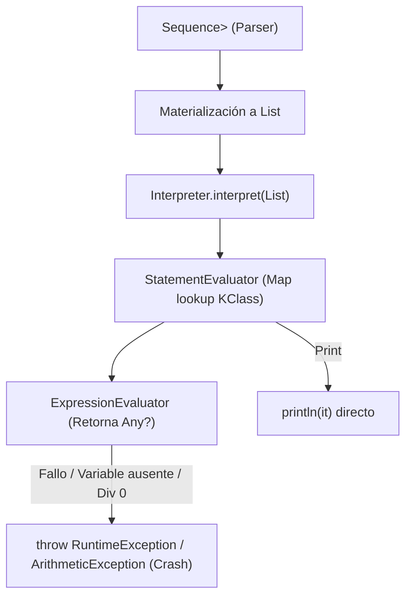
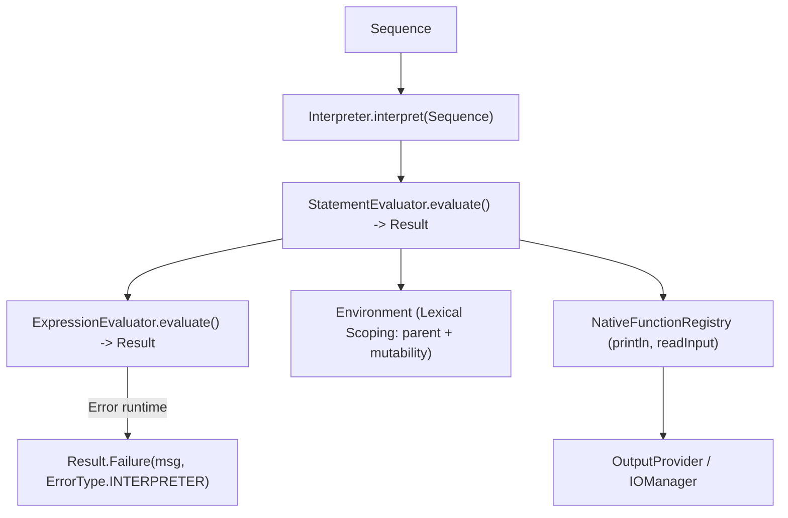

# Reporte Técnico y de Arquitectura: Diagnóstico y Análisis Crítico del Módulo Interpreter

**Fecha:** 2026-09-08  
**Tópico:** `interpreter-analysis`  
**Rama:** `50-refactor`  
**Ubicación:** `Ing Sis/report/2026-09-08_interpreter-analysis_50-refactor.md`  

---

## 1. Resumen Ejecutivo y Alcance

Tras completar la modernización del pipeline de **Lexer** y **Parser predictivo $LL(2)$** en la rama `50-refactor`, se realizó una auditoría integral del subsistema de ejecución (`:interpreter`, `:ast`, `:semantic`, `:app`) a la luz de los principios definidos en `Agent Context - Personal Reasoning.md`, la especificación del lenguaje y el roadmap de **PrintScript 1.0 / 1.1**.

### Diagnóstico General
El módulo `:interpreter` es actualmente el componente más desfasado arquitectónicamente del repositorio:
1. **Ruptura de Streaming:** Mientras que `:lexer`, `:parser` y `:semantic` operan sobre flujos continuos perezosos (`Sequence`), `:interpreter` obliga a materializar colecciones enteras con `List<Statement>`.
2. **Excepciones Crudas en Runtime:** Se arrojan `RuntimeException` y `ArithmeticException` como mecanismo de control de fallos, ignorando el patrón funcional `Result<T>` (`Success` / `Failure`) establecido en `:common`.
3. **Tipado Débil y Casts Ciegos:** Se abusa de `Any?` en todos los contratos (`Environment`, `ExpressionEvaluator`, `BinaryOperation`), obligando a re-validar tipos dinámicamente con `is Number` en lugar de apoyarse en el sistema de tipos.
4. **Incompletitud frente al AST:** Carece de soporte para `UnaryExpression` (operador unario `-`), fallando en runtime si se evalúa una negación numérica.
5. **Entorno Plano (Sin Scopes Léxicos):** `Environment` no contempla scopes anidados (`parent: Environment?`) ni inmutabilidad (`isMutable`), lo cual bloqueará la extensión a PrintScript 1.1 (`if / else`, `const`).
6. **Cero Cobertura de Pruebas (0% JaCoCo):** El módulo no posee tests unitarios (`interpreter/src/test` no existe), incumpliendo el umbral mínimo del 80% exigido por la configuración de JaCoCo.

---

## 2. Radiografía: Estado Actual vs. Filosofía de Diseño

| Dimensión | Estado Actual en `:interpreter` | Filosofía del Proyecto (`Agent Context`) | Diagnóstico / Severidad |
| :--- | :--- | :--- | :--- |
| **Flujo de Datos** | `interpret(List<Statement>)` bloqueante en memoria. | Streaming perezoso continuo (`Sequence<T>`). | **Alta** (Rompe la continuidad reactiva del compilador). |
| **Manejo de Errores** | `throw RuntimeException(...)`, `ArithmeticException`. | Modelado funcional `Result<T>` sin excepciones de flujo. | **Alta** (Quiebra el pipeline sin estructura ni localización). |
| **Seguridad de Tipos** | `Any?` en todas partes, casts manuales con `as?`. | Tipado fuerte estático y ADTs (`sealed interface`). | **Media-Alta** (Pérdida de garantías de compilación). |
| **Cobertura del AST** | No evalúa `UnaryExpression`. | Cobertura total de nodos generados por el Parser. | **Alta** (Runtime crash ante expresiones sintácticamente válidas). |
| **Manejo de Ámbitos** | `Environment` plano con un único `Map<String, Any?>`. | Mutabilidad encapsulada y scopes léxicos jerárquicos. | **Media** (Deuda técnica crítica para v1.1 `if / const`). |
| **Funciones Nativas** | `println` hardcodeado en `when` dentro de `CallEvaluator`. | OCP: registro desacoplado de funciones built-in / I/O. | **Media** (Dificulta incorporación de `readInput` / `readEnv`). |
| **Duplicación de Código** | Lógica `formatOutput` duplicada en dos módulos. | DRY y única fuente de verdad para valores de dominio. | **Baja-Media** (Higiene de código). |
| **Pruebas y DevOps** | 0 pruebas unitarias (directorio de test inexistente). | Umbral mínimo estricto del 80% en JaCoCo. | **Crítica** (Falla de aseguramiento de calidad). |

---

## 3. Pipeline: Flujo Actual vs. Flujo Objetivo

### 3.1. Flujo Actual (Discontinuo y con Excepciones)



### 3.2. Flujo Propuesto (Continuo, Funcional y Type-Safe)



---

## 4. Análisis Detallado de Falencias y Puntos Ciegos

### 4.1. Ruptura de Streaming (`List<Statement>` vs. `Sequence<Statement>`)
En `Interpreter.kt`:
```kotlin
fun interpret(statements: List<Statement>, environment: Environment) {
    for (statement in statements) {
        interpret(statement, environment)
    }
}
```
* **Problema:** En archivos grandes o ejecuciones interactivas (REPL), forzar `List` exige que el parser procese todo el archivo antes de que el intérprete empiece a ejecutar la primera línea.
* **Solución:** La firma debe aceptar `Sequence<Statement>`, permitiendo ejecutar en streaming sentencia a sentencia, interrumpiendo tempranamente si una sentencia falla (`fail-fast`).

### 4.2. Infracción al Manejo Funcional de Errores
El módulo `:interpreter` arroja excepciones no controladas en múltiples puntos:
* `Environment.kt`: `throw RuntimeException("Undefined variable '$name'.")`
* `NumberOperations.kt`: `if (r == 0.0) throw ArithmeticException("Division by zero")`
* `ExpressionEvaluators.kt`: `val left = ... ?: throw RuntimeException("Null operand")`
* `StatementEvaluators.kt`: `else -> throw RuntimeException("Unknown function: '${statement.function}'")`

Además, en `:common`, el enum `ErrorType` no contempla la fase de ejecución:
```kotlin
enum class ErrorType {
    LEXER,
    PARSER,
    SEMANTIC,
    CLI
    // Falta INTERPRETER
}
```
* **Consecuencia:** En vez de retornar `Failure("Division by zero", ErrorType.INTERPRETER)`, la aplicación aborta por excepción no capturada, violando la regla del proyecto: *"Modelado Funcional de Errores: Evitar excepciones no controladas como mecanismo de control de flujo"*.

### 4.3. Ausencia de Evaluador para `UnaryExpression`
En el módulo `:ast` existe:
```kotlin
data class UnaryExpression(
    val operator: String,
    val operand: Expression
) : Expression
```
El `SemanticAnalyzer` cuenta con reglas unarias para `-`. Sin embargo, `ExpressionEvaluators.kt` no posee ningún `UnaryExpressionEvaluator`.
* **Consecuencia:** Un código como:
  ```typescript
  let a: number = -5;
  ```
  pasa exitosamente el Lexer, Parser y Semantic, pero al llegar al Interpreter arroja:
  `RuntimeException: No evaluator registered for expression type: UnaryExpression`.

### 4.4. Manejo de Variables No Inicializadas (Semántica Pobre)
En PrintScript 1.0 es sintácticamente válido declarar sin inicializar:
```typescript
let x: number;
```
En la implementación actual:
* `DeclarationEvaluator`:
  ```kotlin
  val initialValue = statement.value?.let { interpreter.evaluate(it, environment) }
  environment.define(statement.name, initialValue) // Guarda "x" -> null
  ```
* Si luego se evalúa `x + 1`, `BinaryExpressionEvaluator` hace:
  ```kotlin
  val left = interpreter.evaluate(...) ?: throw RuntimeException("Null operand")
  ```
* **Punto Ciego:** Arroja `"Null operand"` sin contexto. El usuario no sabe si la variable no existe, si no fue inicializada o si la operación falló. `Environment` debe poder distinguir entre variable no declarada y variable declarada pero no inicializada.

### 4.5. `Environment` Plano y Deuda Técnica hacia PrintScript 1.1
Actualmente:
```kotlin
class Environment {
    private val variables = mutableMapOf<String, Any?>()
    fun define(name: String, value: Any?) { variables[name] = value }
    fun get(name: String): Any? { ... }
    fun assign(name: String, value: Any?) { ... }
}
```
* **Punto Ciego 1 (Scopes Léxicos):** No tiene referencia a un scope contenedor (`val parent: Environment? = null`). En v1.1, un bloque `if { let x = 2; }` requiere shadowing y liberación de variables al salir del bloque.
* **Punto Ciego 2 (Inmutabilidad `const`):** `Declaration` ya transporta `val isMutable: Boolean = true`, pero `DeclarationEvaluator` la descarta. `assign` reasigna a ciegas sin validar inmutabilidad.

### 4.6. Duplicación de Lógica de Formateo (Violación de DRY)
Para evitar imprimir `5.0` cuando el número es entero, se implementó la misma lógica en dos archivos distintos:
* `CallEvaluator.kt`:
  ```kotlin
  private fun formatOutput(value: Any?): String {
      if (value is Double && value % 1.0 == 0.0) return value.toInt().toString()
      return value?.toString() ?: "null"
  }
  ```
* `StandardBinaryOperations.kt`:
  ```kotlin
  private fun formatValue(value: Any?): String {
      if (value is Double && value % 1.0 == 0.0) return value.toInt().toString()
      return value?.toString() ?: "null"
  }
  ```
Debe centralizarse en un conversor o modelo de valor del runtime.

### 4.7. Acoplamiento de Funciones Nativas en `CallEvaluator`
Actualmente, `CallEvaluator` tiene `when (statement.function)` hardcodeado:
```kotlin
when (statement.function) {
    "println" -> output(evaluatedArgs.joinToString(" ") { formatOutput(it) })
    else -> throw RuntimeException("Unknown function: '${statement.function}'")
}
```
* **Problema:** Viola el principio Abierto/Cerrado (OCP). En PrintScript 1.1 ingresarán `readInput` y `readEnv`. Modificar `CallEvaluator` para agregar funciones built-in acopla la evaluación de llamadas con las implementaciones específicas de funciones del sistema.
* **Solución:** Introducir una abstracción `NativeFunction` o un `FunctionRegistry` donde `println` sea una función registrada.

### 4.8. Cobertura de Pruebas y Dependencias de Gradle
* En `interpreter/build.gradle.kts`:
  - Depende de `libs.guava` (no se usa).
  - No depende de `:common` (razón por la cual no podía acceder a `Result` ni `ErrorType`).
* No existe ningún test en `interpreter/src/test`. La suite de JaCoCo reportará 0% de cobertura en este módulo.

---

## 5. Plan de Acción y Diseño Recomendado para Refactorización

Para alinear el Intérprete con el resto del compilador, se proponen las siguientes fases de desarrollo:

### Fase 1: Actualización de Contratos y Dominio (`:common`, `:interpreter`)
1. **Incorporar `INTERPRETER` a `ErrorType`:** Permitir fallos tipados de ejecución en `:common`.
2. **Dependencia de `:common` en `:interpreter`:** Agregar `implementation(project(":common"))` en `build.gradle.kts` y remover dependencias no utilizadas (`guava`).
3. **Modelado de Errores en Evaluadores:**
   - `StatementEvaluator.evaluate(statement, env, interp): Result<Unit>`
   - `ExpressionEvaluator.evaluate(expr, env, interp): Result<Any>` (o `Result<RuntimeValue>`)
4. **`UnaryExpressionEvaluator`:** Implementar evaluación de operadores unarios (`-`).

### Fase 2: Robustecimiento de `Environment`
1. **Jerarquía Léxica:** Agregar `val parent: Environment? = null` para soportar scopes anidados.
2. **Soporte de Inmutabilidad y No Inicialización:** Modelar las variables como registros que conocen su valor, su mutabilidad (`isMutable`) y su estado de inicialización (`isInitialized`), evitando valores nulos ambiguos.

### Fase 3: Desacoplamiento de I/O y Funciones Built-in
1. **`NativeFunctionRegistry`:** Extraer `println` a una definición de función nativa inyectable.
2. **Centralización de Formateo:** Crear un formateador canónico de valores de PrintScript para salida estándar y concatenación.

### Fase 4: Streaming y Pipeline en `Interpreter`
1. **`interpret(statements: Sequence<Statement>): Sequence<Result<Unit>>`:** Ejecución perezosa con corte inmediato ante el primer `Failure`.

### Fase 5: Suite de Pruebas Automatizadas
1. Implementar tests unitarios en `interpreter/src/test/kotlin/cnc/interpreter/`:
   - Operaciones aritméticas y precedencia (`+`, `-`, `*`, `/`).
   - División por cero controlada (`Result.Failure`).
   - Concatenación de cadenas y números.
   - Declaración, mutabilidad y detección de variables no inicializadas.
   - Salida formateada de `println`.
   - Cobertura superior al 80% en JaCoCo.
