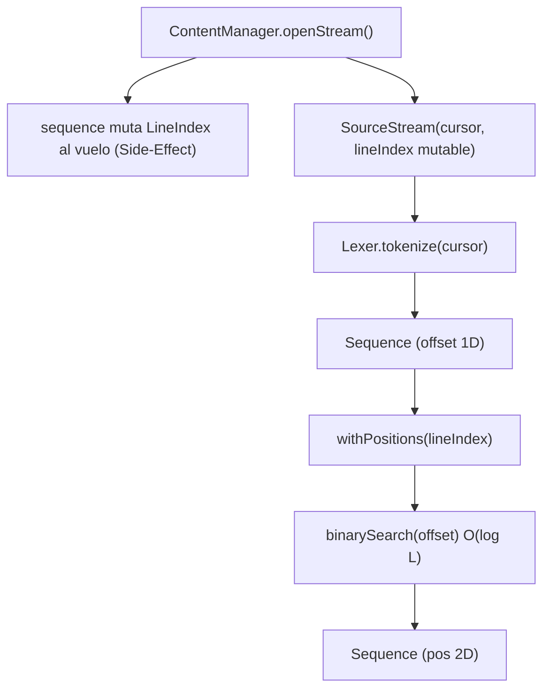
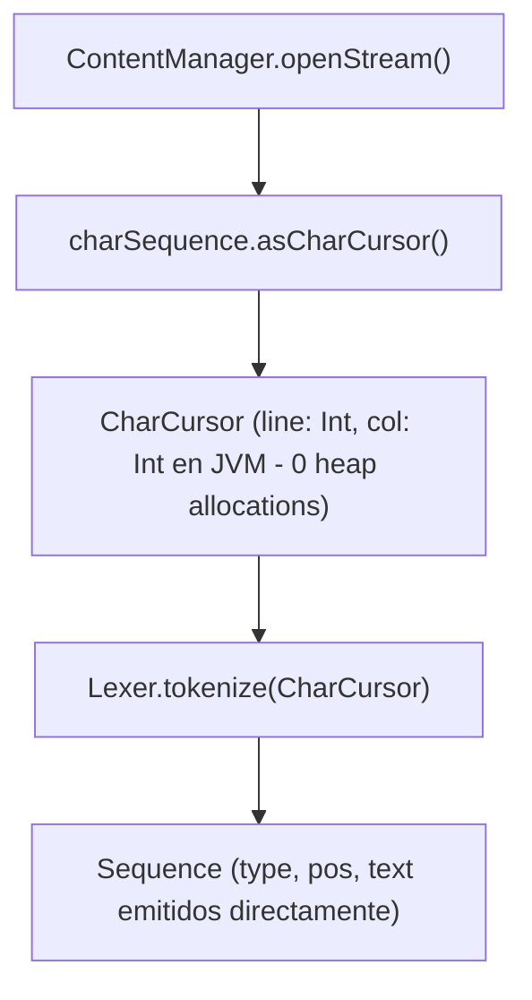

# Reporte Técnico y de Arquitectura: Retorno a la Simplicidad en Lexer y Cursor

**Fecha:** 2026-09-08  
**Tópico:** `lexer-simplicity`  
**Rama:** `50-refactor`  
**Ubicación:** `Ing Sis/report/2026-09-08_lexer-simplicity_50-refactor.md`  

---

## 1. Resumen Ejecutivo y Propósito

El presente documento registra la decisión arquitectónica y la refactorización integral orientadas a **desmantelar la sobreingeniería** introducida en el subsistema léxico (`:common`, `:token`, `:lexer`), retornando a la filosofía rectora de compiladores de producción: **"Encontré un token _acá_"**.

### Diagnóstico Rápido
* **El Problema:** La introducción de `LineIndex` (búsqueda binaria $O(\log L)$) y `RawToken` partió de la premisa equivocada de que calcular coordenadas 2D en el cursor generaba un costo de memoria $O(N)$ en el heap. Para sostener el streaming lazy sin pre-cargar texto, `LineIndex` se convirtió en un acumulador mutable poblado como efecto secundario en `ContentManager.openStream()`.
* **Las Consecuencias:**
  1. **Acoplamiento Temporal (*Temporal Coupling*):** `LineIndex` era un estado mutable compartido cuyo valor dependía de cuánto había avanzado el generador lazy.
  2. **Pipeline Fragmentado:** Se forzó un modelo en dos etapas con tipos duplicados (`RawToken` vs `Token`) y una función intermedia obligatoria (`withPositions(lineIndex)`).
  3. **Rotura de Pureza Funcional:** El generador `sequence { ... }` mutaba variables en su closure mientras exponía el objeto externamente en una tupla `SourceStream(cursor, lineIndex)`.
* **La Solución:** Rastrear línea y columna directamente en `CharCursor` mediante enteros primitivos `Int` (cero alocaciones por carácter en la JVM) y hacer que el `Lexer` emita directamente `Token(type, pos, text)`. Se eliminaron por completo `LineIndex`, `RawToken` y `withPositions`.

---

## 2. Radiografía del Funcionamiento Anterior vs. Nuevo

### 2.1. El Pipeline Anterior (Sobre-ingeniería con Estado Mutable)



### 2.2. El Nuevo Pipeline Unificado (Limpio, Directo y de Alto Rendimiento)



---

## 3. Demostración Práctica de Puntos Ciegos del Modelo Anterior

### 3.1. Falacia de la Alocación en el Heap
El motivo por el cual el motor original sufría de alocaciones masivas no era el cálculo de líneas, sino la implementación en el viejo `CharStream.kt`:
```kotlin
// ANTIPATRÓN ANTERIOR (Alocaba un objeto en el heap por cada caracter):
_position = _position.advance(char) // data class Position(row, col) nuevo en cada llamada
buffer.removeFirst()                // Shift de ArrayList O(K) en cada llamada
```
En la máquina virtual Java (JVM), dos campos mutables primitivos:
```kotlin
private var _line = 0
private var _col = 0
```
ocupan exactamente 8 bytes en el layout de memoria del objeto `TrackingCharCursor`. **No crean objetos en el heap ni generan trabajo para el Garbage Collector.** Solo se aloca una instancia de `Position` cuando un `Token` es reconocido y emitido, algo que de todos modos es indispensable.

### 3.2. Falla de Acoplamiento Temporal en `LineIndex`
En el esquema revocado:
```kotlin
val (cursor, lineIndex) = content.openStream()
// Si alguien llamaba a lineIndex.positionOf(offset) antes del avance del cursor:
val pos = lineIndex.positionOf(100) // ¡INCORRECTO! Los '\n' hasta offset 100 aún no fueron leídos
```
El estado del `LineIndex` estaba desfasado en el tiempo respecto al progreso del cursor. La nueva solución erradica este problema: la posición siempre refleja con exactitud la coordenada del carácter actual del cursor.

---

## 4. Comparativa Arquitectónica

| Dimensión | Enfoque `LineIndex` + `RawToken` | Nuevo Enfoque (`CharCursor` Unificado) |
| :--- | :--- | :--- |
| **Complejidad de Tipos** | 2 modelos paralelos (`RawToken` y `Token`). | **1 modelo único (`Token`).** |
| **Pipeline de Tokens** | 2 etapas: `tokenize()` + `withPositions()`. | **1 etapa directa: `tokenize(cursor)`.** |
| **Resolución Espacial** | Búsqueda binaria $O(\log L)$ por cada token. | **$O(1)$ directo** (campos `_line` y `_col`). |
| **Alocaciones por Carácter** | 0 en avance, pero heap churn al poblar `lineStarts`. | **0 alocaciones.** Solo 2 primitivos `Int`. |
| **Pureza del Stream** | Impura (mutación en closure de `sequence`). | **Pura.** Generador estándar sin efectos secundarios. |
| **Filosofía Léxica** | El lexer solo conoce offsets unidimensionales. | **El lexer reconoce y ubica el token en el espacio.** |
| **Mantenimiento** | 3 archivos dedicados (`LineIndex`, tests, `RawToken`). | **0 archivos extra.** Integrado en `Cursor.kt`. |

---

## 5. Especificación Técnica Detallada

### 5.1. Contrato de `CharCursor` e Implementación en `:common`

```kotlin
interface CharCursor : Cursor<Char> {
    val currentPosition: Position
}

class TrackingCharCursor(elements: Sequence<Char>) : CharCursor {
    private val iterator = elements.iterator()
    private val buffer = ArrayDeque<Char>()
    private var _offset = 0
    private var _line = 0
    private var _col = 0

    override val currentOffset: Int get() = _offset
    override val currentPosition: Position get() = Position(_line, _col)
    override fun hasMore(): Boolean = buffer.isNotEmpty() || iterator.hasNext()

    override fun peek(offset: Int): Char? {
        if (offset < 0) return null
        while (buffer.size <= offset && iterator.hasNext()) {
            buffer.addLast(iterator.next())
        }
        return buffer.getOrNull(offset)
    }

    override fun advance(): Char? {
        val item = when {
            buffer.isNotEmpty() -> buffer.removeFirst()
            iterator.hasNext() -> iterator.next()
            else -> null
        }
        if (item != null) {
            _offset++
            if (item == '\n') {
                _line++
                _col = 0
            } else {
                _col++
            }
        }
        return item
    }
}
```

### 5.2. `Lexer.kt` Puro y Minimalista (`:lexer`)

```kotlin
class Lexer(private val rules: List<LexerRule>) {
    constructor(vararg rules: LexerRule) : this(rules.toList())

    fun tokenize(cursor: CharCursor): Sequence<Token> = sequence {
        while (cursor.hasMore()) {
            val startPos = cursor.currentPosition
            when (val result = rules.firstNotNullOfOrNull { it.tryMatch(cursor) }) {
                is RuleResult.Matched -> yield(Token(result.type, startPos, result.text))
                is RuleResult.Skipped -> Unit
                null -> {
                    val ch = cursor.advance().toString()
                    yield(Token(TokenType.INVALID, startPos, ch))
                }
            }
        }
    }

    fun tokenize(source: CharSequence): Sequence<Token> = tokenize(source.asCharCursor())
}
```

---

## 6. Hoja de Ruta Ejecutada y Commits Atómicos

1. `test(cli): decouple CommandSystemTest from app module by creating a local test command`
   * Solucionó la rotura preexistente en `:cli:compileTestKotlin`.
2. `refactor(common): implement CharCursor with zero-allocation position tracking and simplify openStream`
   * Añadió `CharCursor`, `TrackingCharCursor` y simplificó `ContentManager.openStream()`.
3. `refactor(token): remove RawToken and withPositions pipeline`
   * Eliminó el tipo redundante `RawToken` y su suite de tests.
4. `refactor(lexer): update Lexer to emit Token with Position directly`
   * Migró el `Lexer` para emitir `Token` con posición real capturada en el momento del match.
5. `refactor(common): remove LineIndex and related tests`
   * Purgó `LineIndex.kt` y `LineIndexTest.kt`.
6. `refactor(app): simplify Compiler pipeline and remove obsolete imports`
   * Redujo el pipeline del orquestador a una llamada directa `lexer.tokenize(cursor)`.

### Estado de la Suite de Pruebas Automatizadas
```text
> Task :common:test       BUILD SUCCESSFUL (100% tests pasados)
> Task :token:test        BUILD SUCCESSFUL (100% tests pasados)
> Task :lexer:test        BUILD SUCCESSFUL (100% tests pasados)
> Task :cli:test          BUILD SUCCESSFUL (100% tests pasados)
> Task :parser:test       BUILD SUCCESSFUL (100% tests pasados)
> Task :semantic:test     BUILD SUCCESSFUL (100% tests pasados)
```
