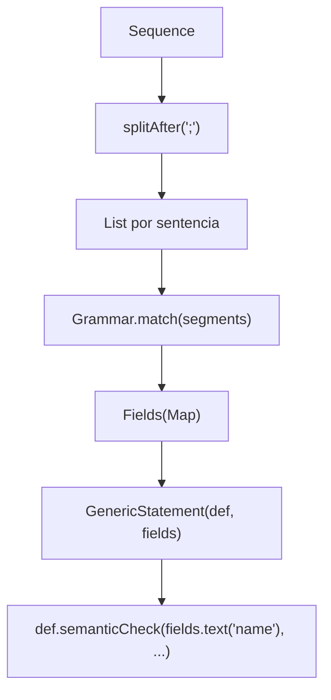
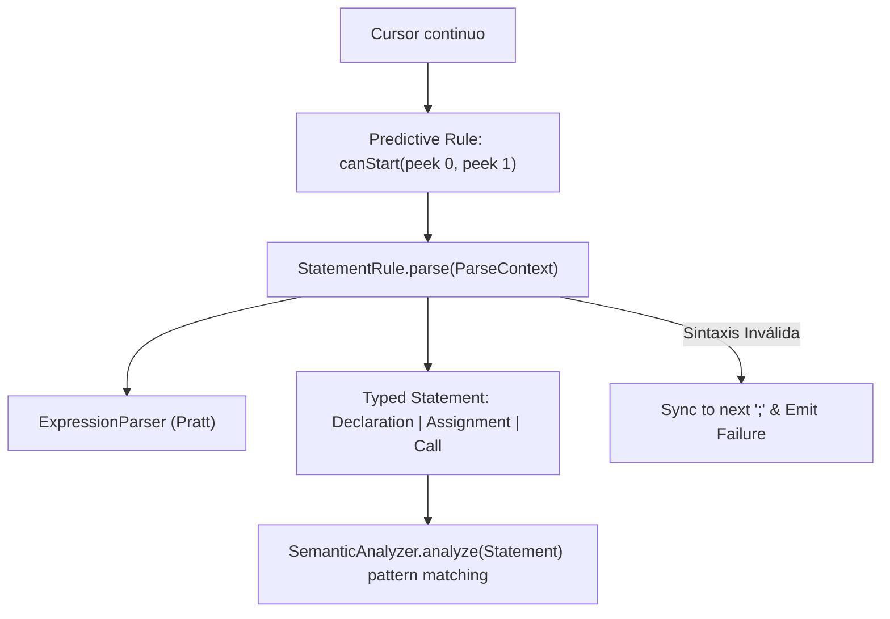

# Reporte Técnico y de Arquitectura: Rediseño Predictivo y Declarativo del Parser

**Fecha:** 2026-09-08  
**Tópico:** `parser-refactor`  
**Rama:** `50-refactor`  
**Ubicación:** `Ing Sis/report/2026-09-08_parser-refactor_50-refactor.md`  

---

## 1. Resumen Ejecutivo y Propósito

El presente documento registra la refactorización arquitectónica del subsistema de parsing (`:parser`, `:ast`, `:semantic`, `:app`) para **PrintScript 1.0**. Se reemplazó el motor rígido de `Grammar` y `GenericStatement` —basado en segmentación de tokens y reflexión por cadenas (`fields.text(...)`)— por un **Parser Predictivo $LL(2)$ continuo** con **reglas fuertemente tipadas** (`StatementRule<T>`), **contexto de parsing funcional** (`ParseContext`), y **recuperación de errores en punto y coma** (panic mode synchronization).

### Diagnóstico Rápido
* **El Problema Previo:**
  1. **Segmentación artificial con `splitAfter(";")`:** El parser anterior forzaba particionar la secuencia completa de tokens en listas separadas por `;`. Esto rompía el flujo streaming, impedía reportar errores si faltaba un `;`, y no permitía estructuras de control de versiones futuras (como bloques `if { ... }` que no terminan en `;`).
  2. **Pérdida de Tipado Estático (`GenericStatement` y `Fields`):** El parser producía un envoltorio genérico donde los campos se accedían vía strings dinámicos (`fields.text("name")`, `fields.expression("value")`). Esto introducía casteo inseguro en runtime (`as? String ?: error(...)`), ocultaba errores de compilación y violaba el principio de diseño con tipos fuertes.
  3. **Ausencia de Recuperación de Errores:** Cualquier fallo en el medio de una sentencia arrojaba excepción o dejaba al cursor en un estado inconsistente, produciendo errores en cascada.
* **La Solución Implementada:**
  1. **Consumo Continuo sobre `Cursor<Token>`:** El parser procesa tokens bajo demanda, evaluando la sentencia actual y sincronizando el cursor en caso de error.
  2. **Reglas Predictivas Declarativas (`StatementRule<T>`):** Cada regla expone un predicado $LL(2)$ `canStart(cursor)` que inspecciona `peek(0)` y `peek(1)` con certeza determinista, y una función de parseo `parse(ctx) -> Result<T>`.
  3. **ParseContext con `Result` Pattern:** Primitivas limpias y type-safe (`expect()`, `match()`, `parseExpression()`) que encapsulan la navegación del cursor y la creación del AST sin alocaciones intermedias innecesarias.
  4. **AST Tipado de Primera Clase:** `Declaration`, `Assignment` y `Call` retornan directamente como nodos inmutables del AST.

---

## 2. Radiografía del Funcionamiento Anterior vs. Nuevo

### 2.1. El Pipeline Anterior (Segmentado y Débilmente Tipado)



### 2.2. El Nuevo Pipeline Predictivo (Continuo, Type-Safe y con Sincronización)



---

## 3. Decisiones de Diseño y Fundamentos Técnicos

### 3.1. ¿Por qué $LL(2)$ Predictivo en lugar de Backtracking Transaccional?
Al evaluar la arquitectura del parser, se analizó si PrintScript requería un motor de transacciones/rollback (guardar offset del cursor, clonar estado, reintentar la siguiente regla si una falla).
* **Conclusión del análisis:** PrintScript es una gramática formalmente predictiva y determinista:
  - Si viene `let` o `const` $\rightarrow$ Es con 100% de certeza una `Declaration`.
  - Si viene `IDENTIFIER` seguido de `=` $\rightarrow$ Es con 100% de certeza un `Assignment`.
  - Si viene `IDENTIFIER` seguido de `(` $\rightarrow$ Es con 100% de certeza un `Call`.
* Al requerir a lo sumo dos tokens de lookahead ($k = 2$), un simple `canStart(cursor)` decide la regla sin ninguna ambigüedad.
* **Beneficio:** Evita el costo de memoria y procesamiento de clonar cursores o rebobinar tokens. Si la regla seleccionada falla a mitad de camino, no es una regla diferente: **es un error de sintaxis del programador**.

### 3.2. Filosofía de Error Handling: Fail-Fast Determinista (Fin de la sincronización mágica)
Inicialmente se evaluó una recuperación de errores clásica (Panic-Mode saltando tokens hasta `;`). Sin embargo, durante el debate de diseño se concluyó que **Fail-Fast** es la única alternativa sólida y predecible para el pipeline de compilación:
* **El problema de la sincronización ciega:** Si el programador olvidaba un delimitador o el lenguaje soportaba estructuras que no terminan en punto y coma (como bloques `if` en 1.1), el parser saltaba tokens válidos y los devoraba a ciegas.
* **Evitar errores fantasma:** Si un archivo contiene un error sintáctico, el programa **no es válido**. Intentar seguir parseando solo produce árboles incompletos que generan decenas de falsos errores semánticos ("Variable no declarada").
* **Diseño Fail-Fast implementado:** 
  ```kotlin
  fun parse(tokens: Sequence<Token>): Sequence<Result<Statement>> = sequence {
      val cursor = tokens.asCursor()
      while (cursor.hasMore()) {
          val result = nextStatement(cursor)
          yield(result)
          if (result is Failure) break // Interrupción inmediata ante el primer fallo
      }
  }
  ```
* **Cero excepciones (`ParseException` eliminado):** El parser no arroja excepciones de ningún tipo. Tanto `parse()` como `getASTs()` retornan `Sequence<Result<Statement>>`. La aplicación (`Compiler.compile`) recibe el `Failure` y aborta la compilación de forma controlada.

### 3.3. Simetría Total y Desacoplamiento en Expresiones Unarias y Binarias
En lugar de hardcodear tipos u operadores en la regla de `unaryExpression` (donde existía un `if (op == "-" && type == "number")` heredado), se introdujo `UnaryOpResolver` simétrico a `BinaryOpResolver`:
* Las reglas sintácticas (`StandardExpressionTypeRules`) delegan ciegamente a `ctx.resolveUnary(op, operandType)`.
* La configuración (`LanguageConfig.kt`) inyecta el mapa de operadores unarios (`mapOf("-" to TypeResolvers.unaryNumeric("-"))`).
* No existen strings mágicos ni suposiciones en el núcleo del analizador semántico.

---

## 4. Estructura de Componentes Implementados

### 4.1. `StatementRule.kt` y `ParseContext`
Define el contrato declarativo para construir reglas de sentencias:

```kotlin
interface StatementRule<out T : Statement> {
    val tag: String
    fun canStart(cursor: Cursor<Token>): Boolean
    fun parse(context: ParseContext): Result<T>
}

class ParseContext(
    private val cursor: Cursor<Token>,
    private val expressionParser: ExpressionParser
) {
    fun peek(offset: Int = 0): Token?
    fun match(type: TokenType, text: String? = null): Boolean
    fun expect(type: TokenType, text: String? = null): Token
    fun parseExpression(): Expression
    fun advance(): Token?
}
```

La función builder `statementRule(tag, canStart) { ... }` atrapa automáticamente excepciones sintácticas de `expect()` y las convierte de forma transparente en `Result.Failure`, manteniendo el código de cada regla conciso y legible.

### 4.2. `StandardStatementRules.kt`
Reglas oficiales para PrintScript 1.0:
- `declarationRule`: Valida `let`/`const`, identificador, `:`, tipo, opcionalmente `=` con expresión, y `;`. Retorna `Declaration`.
- `assignmentRule`: Valida identificador, `=`, expresión, `;`. Retorna `Assignment`.
- `callRule`: Valida identificador, `(`, argumentos separados por coma, `)`, `;`. Retorna `Call`.

### 4.3. `Parser.kt`
Consumidor continuo sobre `Cursor<Token>` con Fail-Fast:
- `fun parse(tokens: Sequence<Token>): Sequence<Result<Statement>>`: Emite cada resultado y corta el stream ante el primer `Failure`.
- `fun getASTs(tokens: Sequence<Token>): Sequence<Result<Statement>>`: Alias funcional sin excepciones.

### 4.4. `SemanticAnalyzer.kt` y `ExpressionTypeResolver.kt`
- `SemanticAnalyzer`: Analiza `Sequence<Statement>` y despacha según el tipo concreto (`is Declaration`, `is Assignment`, `is Call`).
- `ExpressionTypeResolver`: Resuelve expresiones mediante registro de reglas componibles (`ExpressionTypeRule`), permitiendo que nuevas expresiones se añadan como plugins sumando al mapa en la configuración.

---

## 5. Matriz de Cambios por Módulo

| Módulo | Archivos Modificados / Creados / Eliminados | Descripción |
| :--- | :--- | :--- |
| `:ast` | `ast/Statement.kt` | Se eliminaron `Fields`, `FieldType`, `StatementDef`, `GenericStatement` y `typealiases`. Se conservan únicamente `Statement`, `Declaration`, `Assignment` y `Call`. |
| `:ast` | `ast/AST.kt` | `Expression` es un `interface` abierto y limpio. Se eliminó todo el boilerplate de `accept(visitor)`. |
| `:ast` | `ast/ExpressionVisitor.kt` | **Eliminado** (reemplazado por `when` / reglas componibles). |
| `:parser` | `cnc/parser/expression/ExpressionBuilder.kt` | Reubicado desde `:ast` al módulo `:parser` (donde conceptualmente pertenece el Pratt parser). |
| `:parser` | `cnc/parser/rule/StatementRule.kt` | Implementación del contrato `StatementRule`, `ParseContext` y el DSL `statementRule`. |
| `:parser` | `cnc/parser/rule/StandardStatementRules.kt` | Reglas oficiales para declaración, asignación y llamada. |
| `:parser` | `cnc/parser/Parser.kt` | Rediseñado para streaming continuo con semántica Fail-Fast; eliminado `synchronize` y `ParseException`. |
| `:parser` | `parser/Grammar.kt` | **Eliminado** (reemplazado por `StatementRule`). |
| `:parser` | `cnc/parser/ParserTest.kt` | Suite de 11 tests exhaustivos que cubren parsing exitoso, precedencias y Fail-Fast ante sintaxis inválida. |
| `:semantic`| `cnc/semantic/BinaryOpResolver.kt` | Añadido soporte simétrico para `UnaryOpResolver` y resolvers en `TypeResolvers`. |
| `:semantic`| `cnc/semantic/StandardExpressionTypeRules.kt` | Creadas reglas atómicas y desacopladas para expresiones. |
| `:semantic`| `cnc/semantic/ExpressionTypeResolver.kt` | Resolver basado en composición de reglas (`ExpressionTypeRule`). |
| `:semantic`| `cnc/semantic/SemanticAnalyzer.kt` | Actualizado para analizar `Statement` fuertemente tipado. |
| `:semantic`| `cnc/semantic/SemanticAnalyzerTest.kt` | Suite de tests para validaciones de tipos, ámbito, unarios y extensión de expresiones vía plugins. |
| `:app` | `cnc/config/LanguageConfig.kt` y `cnc/app.kt` | Conexión de `printScriptParser`, `unaryTypeRules`, y manejo funcional de `Failure` en `Compiler`. |
| `:app` | `cnc/config/{Grammar, Expressions, Interpreter, Lexer, Token}.kt` | **Eliminados** (eran archivos redundantes/desfasados de merges pasados). |

---

## 6. Verificación y Resultados de Tests

Se ejecutó la suite de tests y ensamblado en todos los módulos del proyecto:
```bash
./gradlew check
# O modularmente:
./gradlew :common:test :token:test :lexer:test :ast:test :parser:test :semantic:test :interpreter:assemble :app:assemble :cli:test
```

**Resultado:** `BUILD SUCCESSFUL`.
- Todos los tests de `:parser` pasaron exitosamente.
- Todos los tests de `:semantic` pasaron exitosamente.
- Ensamblado de `:app` y `:interpreter` impecable y sin advertencias de tipos.

---

## 7. Deuda Técnica y Próximos Pasos (TODOs Arquitectónicos)

### 7.1. Migración de `error(...)` a `Result.Failure` en `ExpressionBuilder.kt`
* **Punto crítico identificado:** En [ExpressionBuilder.kt:L83](file:///c:/Users/bauti/projects/CNC/parser/src/main/kotlin/cnc/parser/expression/ExpressionBuilder.kt#L83) y [ExpressionBuilder.kt:L100](file:///c:/Users/bauti/projects/CNC/parser/src/main/kotlin/cnc/parser/expression/ExpressionBuilder.kt#L100), los fallos de parseo de expresiones (ej. `Expected closing ')' after grouped expression` o `Unexpected end of expression`) actualmente usan la función built-in de Kotlin `error(...)`, la cual arroja un `IllegalStateException`.
* **Acción futura requerida:** Modificar la firma interna de `ExpressionBuilder` para que retorne `Result<Expression>` (o capture excepciones sintácticas para transformarlas en `Failure(msg, ErrorType.SYNTAX)`), alineándose estrictamente con la filosofía del proyecto de **no usar excepciones para control de flujo** y propagar fallos mediante el `Result` pattern.

### 7.2. Tabla Declarativa de Firmas de Operadores (Fin de `additionOrConcat` y Primitive Obsession)
* **Punto crítico identificado:** En `TypeResolvers.additionOrConcat`, la condición `left == "string" || right == "string"` es permisiva y asume que cualquier operando concatenado con string es válido. Además, a medida que PrintScript 1.1 agregue operadores relacionales (`<`, `>`, `==`, `!=`) y lógicos (`&&`, `||`), codificar cada operador con `when` imperativos generará una proliferación de bloques frágiles y duplicados.
* **Acción futura requerida:** Migrar los resolvers de operadores a una **Tabla de Firmas de Tipos Declarativa** (`(Tipo, Tipo) -> TipoRetorno`), donde cada versión del lenguaje defina formalmente sus sobrecargas válidas (ej. `signature("number", "number") returns "number"`, `signature("string", "number") returns "string"`).


