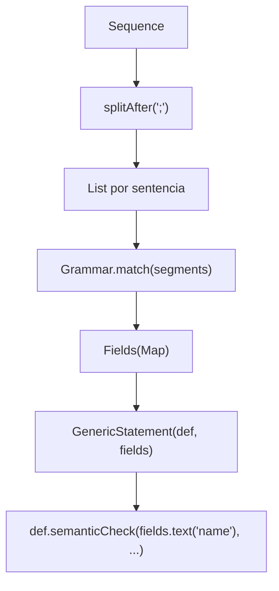
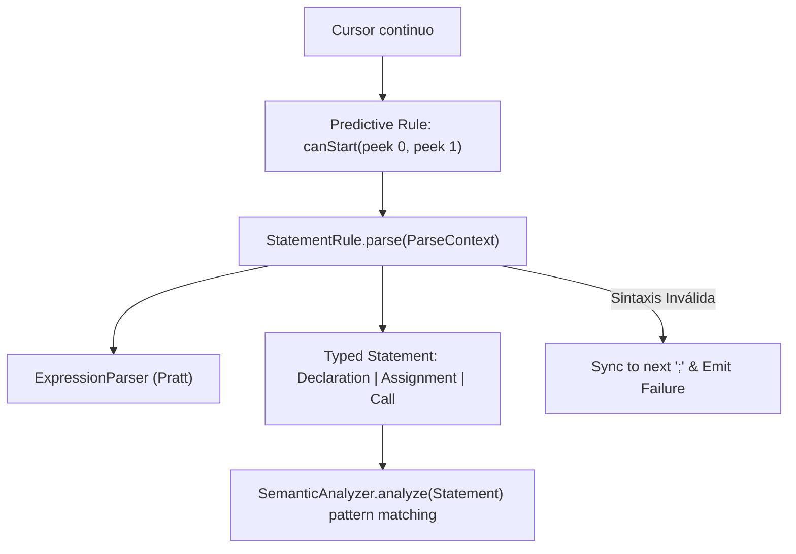

# Reporte Técnico y de Arquitectura: Rediseño Predictivo y Declarativo del Parser

**Fecha:** 2026-09-08  
**Tópico:** `parser-refactor`  
**Rama:** `50-refactor`  
**Ubicación:** `Ing Sis/report/2026-09-08_parser-refactor_50-refactor.md`  

---

## 1. Resumen Ejecutivo y Propósito

El presente documento registra la refactorización arquitectónica del subsistema de parsing (`:parser`, `:ast`, `:semantic`, `:app`) para **PrintScript 1.0**. Se reemplazó el motor rígido de `Grammar` y `GenericStatement` —basado en segmentación de tokens y reflexión por cadenas (`fields.text(...)`)— por un **Parser Predictivo $LL(2)$ continuo** con **reglas fuertemente tipadas** (`StatementRule<T>`), **contexto de parsing funcional** (`ParseContext`), y **recuperación de errores en punto y coma** (panic mode synchronization).

### Diagnóstico Rápido
* **El Problema Previo:**
  1. **Segmentación artificial con `splitAfter(";")`:** El parser anterior forzaba particionar la secuencia completa de tokens en listas separadas por `;`. Esto rompía el flujo streaming, impedía reportar errores si faltaba un `;`, y no permitía estructuras de control de versiones futuras (como bloques `if { ... }` que no terminan en `;`).
  2. **Pérdida de Tipado Estático (`GenericStatement` y `Fields`):** El parser producía un envoltorio genérico donde los campos se accedían vía strings dinámicos (`fields.text("name")`, `fields.expression("value")`). Esto introducía casteo inseguro en runtime (`as? String ?: error(...)`), ocultaba errores de compilación y violaba el principio de diseño con tipos fuertes.
  3. **Ausencia de Recuperación de Errores:** Cualquier fallo en el medio de una sentencia arrojaba excepción o dejaba al cursor en un estado inconsistente, produciendo errores en cascada.
* **La Solución Implementada:**
  1. **Consumo Continuo sobre `Cursor<Token>`:** El parser procesa tokens bajo demanda, evaluando la sentencia actual y sincronizando el cursor en caso de error.
  2. **Reglas Predictivas Declarativas (`StatementRule<T>`):** Cada regla expone un predicado $LL(2)$ `canStart(cursor)` que inspecciona `peek(0)` y `peek(1)` con certeza determinista, y una función de parseo `parse(ctx) -> Result<T>`.
  3. **ParseContext con `Result` Pattern:** Primitivas limpias y type-safe (`expect()`, `match()`, `parseExpression()`) que encapsulan la navegación del cursor y la creación del AST sin alocaciones intermedias innecesarias.
  4. **AST Tipado de Primera Clase:** `Declaration`, `Assignment` y `Call` retornan directamente como nodos inmutables del AST.

---

## 2. Radiografía del Funcionamiento Anterior vs. Nuevo

### 2.1. El Pipeline Anterior (Segmentado y Débilmente Tipado)



### 2.2. El Nuevo Pipeline Predictivo (Continuo, Type-Safe y con Sincronización)



---

## 3. Decisiones de Diseño y Fundamentos Técnicos

### 3.1. ¿Por qué $LL(2)$ Predictivo en lugar de Backtracking Transaccional?
Al evaluar la arquitectura del parser, se analizó si PrintScript requería un motor de transacciones/rollback (guardar offset del cursor, clonar estado, reintentar la siguiente regla si una falla).
* **Conclusión del análisis:** PrintScript es una gramática formalmente predictiva y determinista:
  - Si viene `let` o `const` $\rightarrow$ Es con 100% de certeza una `Declaration`.
  - Si viene `IDENTIFIER` seguido de `=` $\rightarrow$ Es con 100% de certeza un `Assignment`.
  - Si viene `IDENTIFIER` seguido de `(` $\rightarrow$ Es con 100% de certeza un `Call`.
* Al requerir a lo sumo dos tokens de lookahead ($k = 2$), un simple `canStart(cursor)` decide la regla sin ninguna ambigüedad.
* **Beneficio:** Evita el costo de memoria y procesamiento de clonar cursores o rebobinar tokens. Si la regla seleccionada falla a mitad de camino, no es una regla diferente: **es un error de sintaxis del programador**.

### 3.2. Sincronización y Recuperación ante Errores (Panic Mode Recovery)
Cuando un programador omite un token (por ejemplo, olvida los dos puntos `:` en `let x number = 5;`):
1. `expect(TokenType.SYMBOL, ":")` falla y retorna un `Failure(msg, ErrorType.SYNTAX)`.
2. El `Parser` captura el fallo y emite el `Result.Failure`.
3. Para evitar que el resto de los tokens (`number`, `=`, `5`, `;`) sean interpretados erróneamente como nuevas sentencias, el parser ejecuta `synchronize()`: avanza consumiendo tokens hasta encontrar el delimitador de sentencia (`;`) y lo consume.
4. El parser queda listo y alineado para procesar la siguiente sentencia limpia.

### 3.3. Separación Limpia de Responsabilidades (SRP) y Fin de `StatementDef`
En la versión anterior, la validación semántica estaba incrustada en `StatementDef` junto a la definición léxica de los campos.
* **Problema:** Mezclaba análisis léxico/sintáctico con semántica, y forzaba el uso de `Fields` (mapas heterogéneos `Map<String, Any>`).
* **Solución:** 
  - `:ast` contiene únicamente los nodos de datos puros (`Statement`, `Expression`).
  - `:parser` se ocupa exclusivamente de transformar tokens en `Statement`.
  - `:semantic` se ocupa de las reglas semánticas (tabla de símbolos, tipos compatibles, variables ya declaradas) mediante pattern matching directo y exhaustivo sobre el AST tipado (`when (stmt)`).

---

## 4. Estructura de Componentes Implementados

### 4.1. `StatementRule.kt` y `ParseContext`
Define el contrato declarativo para construir reglas de sentencias:

```kotlin
interface StatementRule<out T : Statement> {
    val tag: String
    fun canStart(cursor: Cursor<Token>): Boolean
    fun parse(context: ParseContext): Result<T>
}

class ParseContext(
    private val cursor: Cursor<Token>,
    private val expressionParser: ExpressionParser
) {
    fun peek(offset: Int = 0): Token?
    fun match(type: TokenType, text: String? = null): Boolean
    fun expect(type: TokenType, text: String? = null): Token
    fun parseExpression(): Expression
    fun advance(): Token?
}
```

La función builder `statementRule(tag, canStart) { ... }` atrapa automáticamente excepciones sintácticas de `expect()` y las convierte de forma transparente en `Result.Failure`, manteniendo el código de cada regla conciso y legible.

### 4.2. `StandardStatementRules.kt`
Reglas oficiales para PrintScript 1.0:
- `declarationRule`: Valida `let`/`const`, identificador, `:`, tipo, opcionalmente `=` con expresión, y `;`. Retorna `Declaration`.
- `assignmentRule`: Valida identificador, `=`, expresión, `;`. Retorna `Assignment`.
- `callRule`: Valida identificador, `(`, argumentos separados por coma, `)`, `;`. Retorna `Call`.

### 4.3. `Parser.kt`
Consumidor continuo sobre `Cursor<Token>` con dos APIs:
- `fun parse(tokens: Cursor<Token>): Sequence<Result<Statement>>`: Emite cada resultado con soporte de recuperación de errores.
- `fun getASTs(tokens: Sequence<Token>): Sequence<Statement>`: Emite directamente los statements válidos (lanzando excepción ante error si se requiere modo estricto).

### 4.4. `SemanticAnalyzer.kt` Tipado
Se actualizó el analizador semántico en `:semantic`:
- Ahora analiza `Sequence<Statement>` y retorna `Sequence<Result<Statement>>`.
- Despacha según el tipo concreto (`is Declaration`, `is Assignment`, `is Call`).
- Se añadieron tests unitarios completos en `SemanticAnalyzerTest.kt`.

---

## 5. Matriz de Cambios por Módulo

| Módulo | Archivos Modificados / Creados / Eliminados | Descripción |
| :--- | :--- | :--- |
| `:ast` | `ast/Statement.kt` | Se eliminaron `Fields`, `FieldType`, `StatementDef` y `GenericStatement`. Se conservan únicamente `Statement`, `Declaration`, `Assignment` y `Call`. |
| `:parser` | `cnc/parser/expression/ExpressionBuilder.kt` | Reubicado desde `:ast` al módulo `:parser` (donde conceptualmente pertenece el Pratt parser). |
| `:parser` | `cnc/parser/rule/StatementRule.kt` | Implementación del contrato `StatementRule`, `ParseContext` y el DSL `statementRule`. |
| `:parser` | `cnc/parser/rule/StandardStatementRules.kt` | Reglas oficiales para declaración, asignación y llamada. |
| `:parser` | `cnc/parser/Parser.kt` | Rediseñado para streaming continuo y recuperación de errores. |
| `:parser` | `parser/Grammar.kt` | **Eliminado** (reemplazado por `StatementRule`). |
| `:parser` | `cnc/parser/ParserTest.kt` | Suite de 11 tests exhaustivos que cubren parsing exitoso, expresiones complejas y error recovery. |
| `:semantic`| `cnc/semantic/SemanticAnalyzer.kt` | Actualizado para analizar `Statement` fuertemente tipado. `SemanticContext` reubicado aquí. |
| `:semantic`| `cnc/semantic/SemanticAnalyzerTest.kt` | Nueva suite de tests para validaciones de tipos, ámbito y redeclaraciones. |
| `:app` | `cnc/config/LanguageConfig.kt` y `cnc/app.kt` | Conexión del nuevo `printScriptParser` con `StandardStatementRules.printScript10`. |
| `:app` | `cnc/config/{Grammar, Expressions, Interpreter, Lexer, Token}.kt` | **Eliminados** (eran archivos redundantes/desfasados de merges pasados). |

---

## 6. Verificación y Resultados de Tests

Se ejecutó la suite de tests y ensamblado en todos los módulos del proyecto:
```bash
./gradlew check
# O modularmente:
./gradlew :common:test :token:test :lexer:test :ast:test :parser:test :semantic:test :interpreter:assemble :app:assemble :cli:test
```

**Resultado:** `BUILD SUCCESSFUL`.
- Todos los tests de `:parser` pasaron exitosamente (declaraciones, asignaciones, llamadas, precedencia de operadores, error recovery en `;`).
- Todos los tests de `:semantic` pasaron exitosamente.
- Ensamblado de `:app` y `:interpreter` impecable y sin advertencias de tipos.
