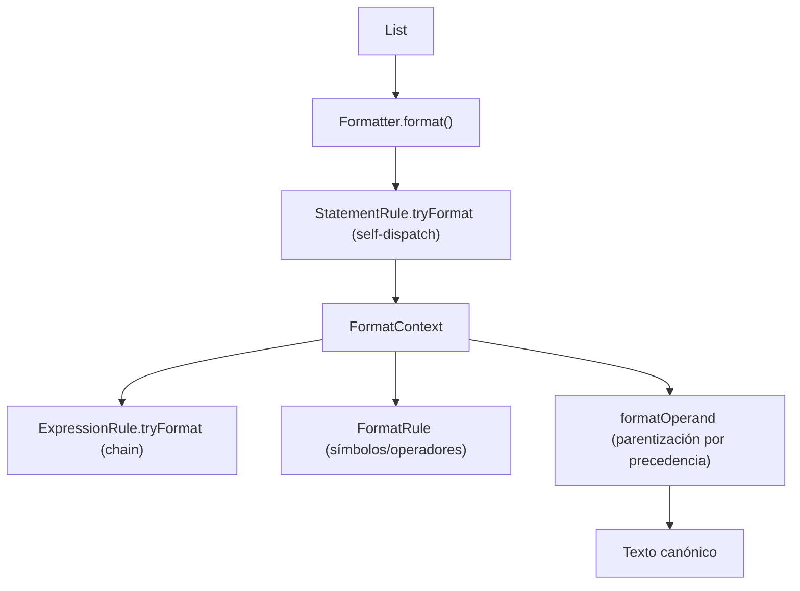

# Módulo: :formatter

**Ruta:** `/formatter`
**Dependencias directas:** `:common`, `:ast`
**Consumidores:** `:app`

---

## 1. Responsabilidad y Propósito (SRP)
- **Qué problema resuelve:** Convierte un AST en su representación textual canónica (*pretty-printing*), aplicando reglas de estilo configurables (espaciado, saltos de línea, parentización por precedencia) sin conocer la sintaxis concreta de PrintScript.
- **Qué hace:**
  - Despacha cada sentencia mediante reglas con *self-dispatch* (`StatementRule`).
  - Renderiza expresiones probando reglas en orden (*chain of responsibility*, `ExpressionRule`).
  - Formatea símbolos y operadores con reglas de espaciado inyectadas (`FormatRule<String>`).
  - Reintroduce paréntesis según precedencia de operadores, centralizando esa lógica en `formatOperand`.
- **Qué NO hace (Fronteras):**
  - No conoce PrintScript: todas las reglas concretas se inyectan desde `app/config/`.
  - No parsea ni valida: recibe un AST ya construido por el `:parser`.
  - No depende de `:parser` ni de `:interpreter`; solo de `:ast` y `:common`.

---

## 2. Arquitectura y Componentes Clave

### Diagrama de Componentes


### Entidades de Dominio e Interfaces
1. **`Formatter`:**
   - Motor genérico: `fun format(ast: List<Statement>): String`.
   - Recibe `statementRules`, `symbolRules`, `expressionRules` y un mapa de `precedences`.
   - Construye internamente un `FormatContext` que las reglas usan para componer sub-renders.
2. **`FormatContext`:**
   - Capacidades de sub-render entregadas a cada regla: `formatStatement`, `formatExpression`, `formatSymbol` y `formatOperand`.
   - Evita que las reglas reimplementen espaciado, render de expresiones o parentización.
3. **`StatementRule` (fun interface):**
   - Self-dispatch: `fun tryFormat(statement, context): String?`. Devuelve `null` si la regla no aplica al statement.
4. **`ExpressionRule` (fun interface):**
   - Self-dispatch para expresiones: `fun tryFormat(expr, context): String?`. El motor prueba las reglas en orden y usa la primera no-null.
5. **`FormatRule<T>` (fun interface):**
   - Regla genérica `fun format(node: T, context): String`. Usada para símbolos/operadores (`FormatRule<String>`).
6. **`OperandSide`:**
   - `enum { LEFT, RIGHT }`. Indica el lado de un operando en una expresión binaria para la parentización por asociatividad.

---

## 3. Manejo de Errores y Pipeline Funcional
- **Modelo de fallos:** El formatter asume un AST bien formado y una configuración completa. Si ningún `StatementRule`/`ExpressionRule` aplica, o falta la `FormatRule` de un símbolo o la precedencia de un operador, falla en runtime con `IllegalStateException` (`error(...)`).
- **Racional:** Estos son errores de configuración del desarrollador (reglas incompletas), no del código de usuario; por eso son excepciones y no `Result<T>`.

---

## 4. Ejemplo Práctico Autónomo (End-to-End)

```kotlin
package example

import cnc.ast.*
import cnc.formatter.*

fun main() {
    // 1. Reglas de expresión (self-dispatch): cada una devuelve null si no aplica
    val numberRule = ExpressionRule { e, _ ->
        (e as? NumberLiteral)?.let { if (it.value % 1.0 == 0.0) it.value.toLong().toString() else it.value.toString() }
    }
    val identifierRule = ExpressionRule { e, _ -> (e as? Identifier)?.name }
    val binaryRule = ExpressionRule { e, ctx ->
        (e as? BinaryExpression)?.let { bin ->
            val prec = mapOf("+" to 1, "*" to 2).getValue(bin.operator)
            val left = ctx.formatOperand(bin.left, prec, OperandSide.LEFT)
            val right = ctx.formatOperand(bin.right, prec, OperandSide.RIGHT)
            "$left${ctx.formatSymbol(bin.operator)}$right"
        }
    }

    // 2. Reglas de símbolo (espaciado) y precedencias
    val symbolRules = mapOf<String, FormatRule<String>>(
        "+" to FormatRule { s, _ -> " $s " },
        "*" to FormatRule { s, _ -> " $s " },
        "let" to FormatRule { s, _ -> s },
        ":" to FormatRule { s, _ -> "$s " },
        "=" to FormatRule { s, _ -> " $s " },
        ";" to FormatRule { s, _ -> s }
    )
    val precedences = mapOf("+" to 1, "*" to 2)

    // 3. Regla de statement: Declaration -> "let name: type = value;"
    val declRule = StatementRule { stmt, ctx ->
        (stmt as? Declaration)?.let { d ->
            "${ctx.formatSymbol("let")} ${d.name}${ctx.formatSymbol(":")}${d.type}" +
                "${ctx.formatSymbol("=")}${ctx.formatExpression(d.value!!)}${ctx.formatSymbol(";")}"
        }
    }

    val formatter = Formatter(listOf(declRule), symbolRules, listOf(numberRule, identifierRule, binaryRule), precedences)

    // 4. (1 + 2) * 3 → los paréntesis se reintroducen por precedencia
    val expr = BinaryExpression(BinaryExpression(NumberLiteral(1.0), "+", NumberLiteral(2.0)), "*", NumberLiteral(3.0))
    val ast = listOf(Declaration("z", "number", expr))
    println(formatter.format(ast))
    // let z: number = (1 + 2) * 3;
}
```

---

## 5. Integración en el Pipeline del Compilador
- **Entrada:** `List<Statement>` producida por el `:parser`.
- **Salida:** `String` con el código formateado. Al igual que el `:linter`, es una herramienta lateral que consume el AST, no una etapa del flujo de ejecución.

---

## 6. Decisiones Técnicas y Tradeoffs
- **Motor agnóstico + reglas inyectadas (Decisiones 7 y 8):** El `Formatter` no conoce PrintScript. Toda la sintaxis concreta (qué es `let`, cómo se espacian los operadores) vive en `app/config/`, permitiendo formatear dialectos o versiones distintas sin tocar el motor.
- **Self-dispatch vs Visitor / Map por tipo (Decisión 9):** Cada regla se autoevalúa y devuelve `null` si no aplica. Extender = agregar una regla a la lista, sin modificar clases existentes ni castear por `KClass`. Precio: no hay exhaustividad en compilación; un nodo sin regla falla en runtime.
- **Parentización centralizada (Decisión 10):** La lógica de "¿necesita paréntesis?" vive solo en `formatOperand`/`needsParentheses`, comparando precedencia del hijo contra el padre. Las reglas de expresión binaria la usan sin conocer el algoritmo.
