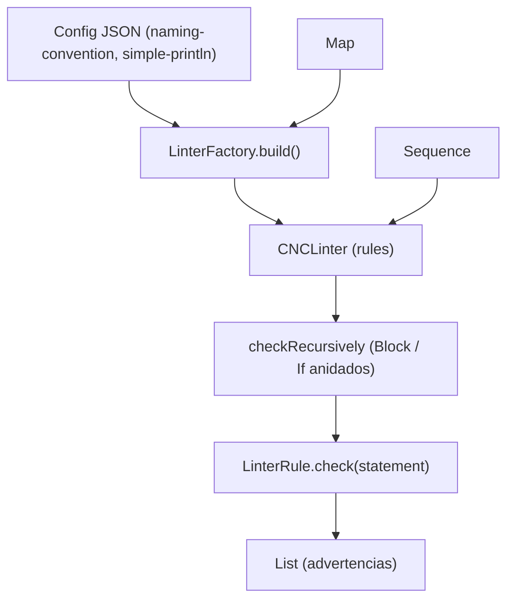

# Módulo: :linter

**Ruta:** `/linter`
**Dependencias directas:** `:common`, `:ast` (+ `gson` para parseo de configuración)
**Consumidores:** `:app`

---

## 1. Responsabilidad y Propósito (SRP)
- **Qué problema resuelve:** Realiza análisis estático de estilo sobre el AST ya parseado, emitiendo advertencias (*warnings*) sobre convenciones de código configurables, sin modificar el programa ni interrumpir su ejecución.
- **Qué hace:**
  - Recorre recursivamente el AST (incluyendo bloques anidados y ramas de `if`/`else`) aplicando un conjunto de reglas (`LinterRule`).
  - Provee reglas estándar: convención de nombres (`NamingConventionRule`) y restricción de expresiones complejas en `println` (`SimplePrintlnRule`).
  - Construye el linter a partir de una configuración JSON (`LinterFactory`), inyectando validadores de nombres desacoplados (`NamingValidator`).
  - Provee validadores estándar: `CamelCaseValidator` y `SnakeCaseValidator`.
- **Qué NO hace (Fronteras):**
  - No modifica el código fuente ni el AST (eso es responsabilidad del `:formatter`).
  - No valida tipos ni semántica (responsabilidad de `:semantic`).
  - No detiene el pipeline: acumula advertencias y las retorna como una lista de mensajes.

---

## 2. Arquitectura y Componentes Clave

### Diagrama de Componentes


### Entidades de Dominio e Interfaces
1. **`CNCLinter`:**
   - Orquestador: `fun lint(statements: Sequence<Statement>): List<String>`.
   - Recorre el AST de forma recursiva (`checkRecursively`), descendiendo en `BlockStatement` y en las ramas `thenBlock` / `elseBlock` de `IfStatement`.
2. **`LinterRule`:**
   - Interfaz funcional: `fun check(statement: Statement): List<String>`. Devuelve las advertencias que aplican a ese statement (o lista vacía).
3. **`NamingConventionRule`:**
   - Valida que las `Declaration` cumplan una convención de nombres delegando en un `NamingValidator` inyectado.
4. **`SimplePrintlnRule`:**
   - Advierte cuando una llamada a `println` recibe una `BinaryExpression` (expresión compleja) como argumento.
5. **`NamingValidator` (fun interface):**
   - Contrato `fun isValid(name: String): Boolean`. Implementaciones estándar: `CamelCaseValidator`, `SnakeCaseValidator`. Extensible con validadores propios.
6. **`LinterFactory`:**
   - Construye un `CNCLinter` desde un JSON (`LinterConfigDto`) resolviendo el validador de nombres por clave contra el mapa de validadores inyectado.

---

## 3. Manejo de Errores y Pipeline Funcional
- **Modelo de salida:** El linter no usa `Result<T>`; su salida es una `List<String>` de advertencias. Una lista vacía significa "sin observaciones".
- **Errores de configuración:** Si la config referencia una convención sin validador registrado, `LinterFactory` lanza `IllegalArgumentException` (error de configuración del desarrollador, no del código analizado).

---

## 4. Ejemplo Práctico Autónomo (End-to-End)

```kotlin
package example

import cnc.ast.*
import cnc.linter.*

fun main() {
    // 1. Configurar linter desde JSON, inyectando validadores disponibles
    val validators = mapOf(
        "camelCase" to CamelCaseValidator(),
        "snake_case" to SnakeCaseValidator()
    )

    val configJson = """
        {
            "naming-convention": "camelCase",
            "simple-println": true
        }
    """.trimIndent()

    val linter = LinterFactory.build(configJson, validators)

    // 2. Analizar un AST con dos infracciones
    val programa = sequenceOf<Statement>(
        Declaration("bad_name", "number", NumberLiteral(1.0)),           // no es camelCase
        Call("println", listOf(BinaryExpression(Identifier("a"), "*", Identifier("b")))) // expresión compleja
    )

    val advertencias = linter.lint(programa)
    advertencias.forEach { println("WARN: $it") }
    // WARN: La variable 'bad_name' debería estar en formato camelCase.
    // WARN: La llamada a 'println' no permite expresiones complejas.

    // 3. Validador personalizado inyectado (notación húngara)
    val custom = mapOf<String, NamingValidator>("hungarian" to NamingValidator { it.startsWith("m_") })
    val linterCustom = LinterFactory.build("""{ "naming-convention": "hungarian" }""", custom)
    println(linterCustom.lint(sequenceOf(Declaration("count", "number", NumberLiteral(1.0)))))
    // [La variable 'count' debería estar en formato hungarian.]
}
```

---

## 5. Integración en el Pipeline del Compilador
- **Entrada:** `Sequence<Statement>` producida por el `:parser` (opcionalmente ya validada por `:semantic`).
- **Salida:** `List<String>` de advertencias reportadas al usuario. Es una herramienta lateral: no forma parte del flujo lexer → parser → semantic → interpreter, sino que consume el AST en paralelo.

---

## 6. Decisiones Técnicas y Tradeoffs
- **Validadores inyectados vs hardcodeados:** `NamingValidator` es una `fun interface` inyectada por mapa. Agregar una convención nueva (ej: `PascalCase`, notación húngara) no requiere tocar `NamingConventionRule` ni el motor.
- **Reglas componibles:** Cada `LinterRule` es autónoma y se agrega a la lista del `CNCLinter`. El conjunto activo se decide por configuración JSON, no en código.
- **Recorrido recursivo del AST:** El linter desciende en `BlockStatement` e `IfStatement` (PrintScript 1.1) para analizar sentencias anidadas, no solo el nivel superior.
- **Salida como lista de mensajes:** Se prioriza recolectar *todas* las advertencias en una pasada (no fail-fast), a diferencia del pipeline de compilación que se detiene ante el primer error.
